# GDD - Game Design Document - Módulo 1 - Inteli

## Thinkers Journey

### Nome do grupo

- Thinkers

#### Nomes dos integrantes do grupo

- Carolina Serra Jorge
- João Pedro de Barros Lima Dantas Peixoto
- Samuel Yenyu Chen 
- Isabela Teixeira Coldibella
- Enzo Ferrer Campoi
- Pedro Lee Vieira Abílio
- William Martins Moraes

## Sumário

[1. Introdução](#c1)

[2. Visão Geral do Jogo](#c2)

[3. Game Design](#c3)

[4. Desenvolvimento do jogo](#c4)

[5. Casos de Teste](#c5)

[6. Conclusões e trabalhos futuros](#c6)

[7. Referências](#c7)

[Anexos](#c8)

 

# 1. Introdução 

## 1.1. Plano Estratégico do Projeto

### 1.1.1. Contexto da indústria 

O mercado de Inteligência Artificial em 2026 é impulsionado por líderes como OpenAI, Google e IBM, que estruturam o setor por meio de APIs escaláveis, modelos fundacionais e ecossistemas educacionais próprios. Paralelamente, o mercado global de EdTech e jogos educacionais cresce com plataformas como Coursera e Udemy, enquanto iniciativas corporativas como IBM SkillsBuild ampliam o acesso à formação em IA como estratégia de responsabilidade social.

A principal tendência é a transição para Sistemas Agênticos: IAs capazes de executar tarefas de forma autônoma somada a microlearning e aprendizagem imersiva. Contudo, o avanço acelerado da tecnologia gerou um “abismo de letramento”: usuários utilizam IA, mas não compreendem seus fundamentos. A concorrência ainda privilegia cursos densos e teóricos, abrindo espaço estratégico para soluções de AI Literacy baseadas em jogos digitais. Nesse cenário, a IBM posiciona-se ao integrar capacitação em IA, impacto social e engajamento interativo, transformando aprendizado prático em vantagem competitiva.

#### 1.1.1.1. Modelo de 5 Forças de Porter

##### Rivalidade entre Concorrentes: Alta

No lado de e-learning, plataformas como Coursera e Google Grow já oferecem conteúdo de inteligência artificial de forma gratuita e com credibilidade institucional consolidada. No lado de jogos educacionais, Duolingo e Khan Academy dominam com metodologias gamificadas amplamente reconhecidas e bases de usuários massivas. Ambas as frentes representam concorrência indireta relevante, disputando o tempo e a atenção do mesmo público-alvo.
Embora o projeto apresente um diferencial ao combinar simulação de carreira corporativa com minigames e ensino de IA, o ambiente competitivo é composto por grandes players já consolidados, com forte presença global e alto nível de engajamento. Dessa forma, mesmo com a diferenciação proposta, a rivalidade entre concorrentes é considerada alta, pois todos competem diretamente pelo mesmo recurso escasso: a atenção do usuário.

##### Poder de Barganha dos Fornecedores: Médio

Os principais fornecedores identificados para o desenvolvimento e operação do jogo são plataformas de desenvolvimento como Unity e Godot, serviços de infraestrutura em nuvem como AWS, Google Cloud ou Firebase, APIs de inteligência artificial, além do conteúdo pedagógico de referência, neste caso o IBM SkillsBuild. Também se incluem profissionais criativos, como designers e músicos freelancers.
Embora existam alternativas no mercado para a maioria dessas ferramentas, há uma dependência relevante de algumas tecnologias específicas, especialmente no caso de APIs de IA e serviços de nuvem, cuja substituição pode demandar tempo e esforço técnico. Além disso, o uso do conteúdo do IBM SkillsBuild representa uma dependência estratégica importante, pois está diretamente ligado à proposta educacional do jogo.
Dessa forma, o poder de barganha dos fornecedores é considerado médio, já que existem opções disponíveis, mas com custos de troca e adaptação que impactam o desenvolvimento.

##### *Poder de Barganha dos Clientes: Alto

Os principais usuários do jogo são estudantes universitários, especialmente da área de tecnologia, que buscam desenvolver competências em inteligência artificial para o mercado de trabalho. Em um cenário mais amplo, instituições de ensino e empresas também podem se tornar usuários potenciais.
O “pagamento” realizado pelo usuário ocorre principalmente em tempo e atenção, que são recursos altamente disputados no ambiente digital. Além disso, existem inúmeras alternativas disponíveis, como cursos online, vídeos, documentações e até o uso direto de ferramentas de IA, o que torna o custo de troca praticamente inexistente.
Por conta dessa grande oferta de opções e da facilidade de migração entre plataformas, o poder de barganha dos clientes é considerado alto. Isso exige que o jogo ofereça uma experiência realmente envolvente, com progressão clara, feedback constante e valor percebido ao longo da jornada.

##### Ameaça de Produtos ou Serviços Substitutos: Alta

O estudante universitário que deseja aprender sobre inteligência artificial dispõe de diversas alternativas gratuitas, como vídeos no YouTube, certificações em plataformas educacionais, documentação técnica e o uso direto de ferramentas como ChatGPT e Copilot. Além disso, qualquer outro jogo digital também compete diretamente pelo tempo e atenção do usuário.
Embora o projeto busque se diferenciar ao integrar aprendizado com uma narrativa de progressão de carreira e minigames interativos, esses diferenciais não eliminam a existência dos substitutos, apenas tornam a experiência mais atrativa.
Dessa forma, a ameaça de substitutos é considerada alta, já que as alternativas são amplamente acessíveis, variadas e já fazem parte do comportamento do público-alvo.

##### Ameaça de Novos Entrantes: Média/Alta

O mercado de jogos educacionais digitais apresenta barreiras de entrada relativamente baixas do ponto de vista técnico. Ferramentas como Unity e Godot são acessíveis, e o conteúdo sobre inteligência artificial está amplamente disponível em fontes abertas, permitindo que novas equipes desenvolvam soluções semelhantes.
Além disso, grandes empresas como Google e Microsoft possuem capacidade de entrar nesse mercado com facilidade, utilizando sua infraestrutura e base de usuários já consolidadas.
Por outro lado, existem barreiras estratégicas importantes, como a construção de uma experiência de usuário envolvente, o desenvolvimento de uma narrativa consistente e a necessidade de credibilidade educacional. No caso do projeto, a conexão com o IBM SkillsBuild e o foco em uma jornada de progressão de carreira contribuem para aumentar essa barreira.
Assim, a ameaça de novos entrantes é considerada média/alta, pois, apesar da facilidade de entrada inicial, a consolidação de um produto competitivo exige diferenciação e qualidade na execução.

### 1.1.2. Análise SWOT

#### **1.1.2.1. FORÇAS (S)**

A principal força da plataforma reside na combinação de progressão de carreira, minigames e inteligência artificial. É uma proposta sem equivalente direto no mercado. O acesso gratuito facilita a adoção em larga escala, e a narrativa de carreira cria um vínculo com o utilizador difícil de imitar. A referência ao IBM SkillsBuild confere credibilidade pedagógica à solução, que se diferencia ainda por unir aprendizagem e entretenimento numa experiência coesa.

#### **1.1.2.2. FRAQUEZAS (W)**

O modelo gratuito, embora estratégico, não elimina os custos operacionais e levanta questões sobre sustentabilidade a médio prazo. A equipe reduzida e a velocidade de desenvolvimento limitada dificultam a resposta rápida a movimentos de concorrentes mais estruturados. A ausência de uma base de utilizadores consolidada exige investimento contínuo em aquisição.

#### **1.1.2.3. OPORTUNIDADES (O)**

O mercado de EdTech segue em expansão acelerada, impulsionado pela crescente demanda por formação em inteligência artificial, área ainda carente de soluções acessíveis e bem estruturadas. No Brasil, o hábito gamer é cada vez mais difundido, especialmente entre o público universitário de tecnologia, que representa exatamente o perfil da plataforma. A gamificação ganha validação acadêmica progressiva, o que reduz resistências institucionais à abordagem. Nesse contexto, existe uma janela real de first-mover num nicho ainda sem ocupante consolidado.

#### **1.1.2.4. AMEAÇAS (T)**

Empresas como a Google e Microsoft têm recursos para incorporar gamificação às suas plataformas educacionais a qualquer momento, o que representa uma ameaça concreta à proposta diferencial. A baixa barreira técnica do nicho facilita a entrada de novos competidores. Além disso, a plataforma disputa diretamente o tempo e atenção do utilizador com jogos, redes sociais e outras ferramentas. Por fim, o ritmo acelerado de evolução da IA expõe o conteúdo ao risco de desatualização rápida, exigindo revisão contínua do material.

### 1.1.3. Missão / Visão / Valores 

#### Missão:

Criar uma experiência interativa e informativa em inteligências artificiais com a integração didática entre os cursos do IBM SkillsBuilds e uma solução gamificada de simulação corporativa engajante, intuitiva e imersiva para jovens universitários.

#### Visão:

Tornar-se um jogo referência em fazer uma transição assertiva de cursos digitais tradicionais mais densos para o uso de metodologias educacionais modernas, informativas, intuitivas e imersivas. 

#### Valores:

Diversidade cultural, ao trazer diferentes tipos de personagens; ética, ao ensinar as alocações corretas do uso de IA; inovação pedagógica e interatividade, com o uso de minigames para transmitir conceitos complexos e engajar o usuário. 

### 1.1.4. Proposta de Valor

No entendimento de negócios, o Canvas de Proposta de Valor é uma ferramenta estratégica utilizada para estruturar, de forma clara e objetiva, como um produto ou serviço gera valor para o público-alvo. Ele auxilia na identificação das necessidades, expectativas e dores do cliente, permitindo alinhar essas demandas às soluções oferecidas pela equipe. Portanto, sua aplicação é fundamental para orientar decisões mais assertivas, reduzir riscos e aumentar a aderência da proposta ao mercado. 

O modelo é composto por dois polos principais: 

**Perfil do cliente:** descreve suas tarefas, dores e ganhos esperados;

**Mapa de valor:** detalha os produtos, serviços, aliviadores de dores e geradores de ganhos. 

A análise conjunta desses elementos possibilita verificar o grau de compatibilidade entre o que é oferecido e o que o cliente realmente valoriza, contribuindo para o desenvolvimento de soluções mais eficazes e competitivas.

  Canvas Proposta de Valor

  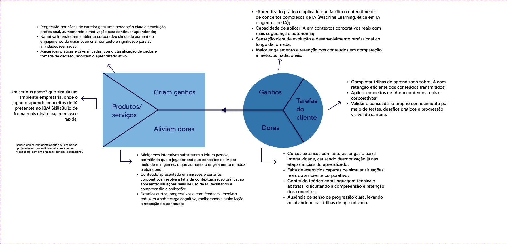

  Fonte - Modelo feito pelo grupo no Figma (2026) 

### 1.1.4.1 Perfil do Cliente

 - **Tarefas do cliente**

As tarefas do público-alvo demonstram uma demanda por experiências de aprendizado que vão além da assimilação passiva de conteúdo, incluindo a necessidade de aplicar, testar e validar conhecimentos em contextos práticos. Tal comportamento reforça a importância de soluções que integrem teoria e prática, oferecendo feedback contínuo e promovendo o desenvolvimento de competências aplicáveis.

- **Dores**

As dores mapeadas evidenciam limitações recorrentes em modelos tradicionais de ensino, como a predominância de conteúdos extensos, pouco interativos e desconectados de aplicações reais. Esse cenário tende a comprometer o engajamento e a retenção do conhecimento, gerando desmotivação, especialmente nas etapas iniciais do aprendizado.

- **Ganhos**

Os ganhos identificados estão alinhados à necessidade de aquisição de conhecimento em um prazo menor. A ênfase na aplicação prática e na validação do aprendizado contribui para aumentar a percepção de utilidade e efetividade da experiência educacional.

### 1.1.4.2 Mapa de Valor

 - **Criadores de Ganho**

 A organização do conteúdo em níveis progressivos, aliada a uma narrativa imersiva, promove uma jornada de aprendizado estruturada e gradual, favorecendo a assimilação contínua dos conceitos. Esse modelo contribui para a construção de um senso de evolução perceptível, elemento fundamental para sustentar o engajamento e incentivar a progressão do usuário ao longo da experiência.

 - **Aliviadores de Dores**

 A proposta atua na redução da sobrecarga cognitiva, ao substituir abordagens excessivamente teóricas por interações práticas e contextualizadas. Dessa forma, diminui-se a barreira inicial de entrada em conteúdos complexos, tornando o processo de aprendizagem mais acessível, especialmente para estudantes que ainda não possuem domínio prévio da temática. No jogo, o jogador aprende os conteúdos ao diálogos com os NPCs, essas conversas são curtas e objetivas, que são mais fáceis de manter a atenção, comparando aos textos longos.

- **Produto/Serviço**

A solução proposta consiste em um serious game estruturado como um ambiente de simulação empresarial, no qual o usuário interage com situações inspiradas em contextos reais de aplicação de inteligência artificial. Essa abordagem amplia a percepção de relevância do conteúdo, ao conectar o aprendizado teórico a práticas profissionais, aspecto particularmente valorizado por estudantes universitários em processo de formação e inserção no mercado de trabalho.

### 1.1.5. Descrição da solução desenvolvida

**a) Problema:**
 
 A IBM tem como objetivo a capacitação em larga escala por meio dos cursos disponibilizados na plataforma IBM SkillsBuild. Entretanto, apesar da robustez técnica e da qualidade dos conteúdos oferecidos, o modelo educacional adotado, predominantemente baseado em extensas cargas teóricas e formatos tradicionais de ensino, apresenta limitações no que diz respeito ao engajamento dos usuários. A ausência de abordagens pedagógicas diversificadas e de experiências mais interativas compromete a retenção do conhecimento e contribui para elevados índices de evasão. Como consequência, parte significativa do público não conclui os cursos, dificultando o alcance pleno do objetivo institucional de formação ampla em inteligência artificial.

 **b) Solução Proposta:**

 Para o desafio de engajamento, foi desenvolvido o Thinkers Journey, um serious game estruturado a partir de os conceitos de IA 
uma perspectiva de simulação de carreira na área de inteligência artificial. No jogo, a personagem inicia sua trajetória como estagiária e progride profissionalmente ao longo dos diferentes andares da empresa fictícia Thinker, que representam níveis crescentes de complexidade e responsabilidade. Nesse contexto, os conceitos de IA presentes no IBM SkillsBuild são introduzidos de forma contextualizada por meio de interações com personagens não jogáveis (NPCs), enquanto os minigames simulam atividades práticas relacionadas ao cotidiano de profissionais da área. Essa abordagem confere propósito direto ao aprendizado, permitindo que o usuário compreenda não apenas o conteúdo teórico, mas também sua aplicação em situações reais, por meio de experimentação e feedback imediato. As fases foram pensadas conforme o ambiente em que o jogador situa, portanto, foi desenvolvido um roteiro que apresenta simulações de problemas comuns e o cotidiano desse ambiente, como o ataque vírus ou uma IA que não está funcionando como deveria. Assim o jogador aprenderá os conceitos de IA e suas aplicações em situações reais.

 **c) Forma de uso:**

 A experiência de uso do Thinkers Journey ocorre em ambiente digital, com foco em plataformas desktop e laptop, e é organizada em fases correspondentes aos diferentes andares da empresa. Em cada fase, o jogador interage com NPCs responsáveis por introduzir conceitos fundamentais de inteligência artificial (machine learning, deep learning, ética, potenciais das IAs) que são posteriormente aplicados em minigames interativos (drag and drop, associações de colunas, avaliação de relatórios). Esses minigames foram concebidos para superar o modelo tradicional de avaliação baseado em quizzes, incorporando mecânicas mais dinâmicas que exigem interpretação, tomada de decisão e aplicação prática dos conhecimentos adquiridos. Além disso, o sistema fornece feedback contínuo ao jogador, permitindo a identificação de erros, o reforço de acertos e o acompanhamento da evolução ao longo da jornada.

 **d) Benefícios:**

 Os benefícios da solução se manifestam em três dimensões. Para o usuário, especialmente estudantes universitários, o jogo oferece uma experiência de aprendizado mais envolvente, interativa e orientada à prática, favorecendo maior retenção de conteúdo e desenvolvimento de perspectiva de aplicação dos conceitos de IA. Para a IBM, o Thinkers Journey representa uma alternativa inovadora às abordagens tradicionais de ensino, contribuindo para a diversificação das estratégias educacionais no contexto do SkillsBuild e ampliando o potencial de engajamento dos usuários. Em âmbito social, a solução fortalece iniciativas de democratização do acesso ao conhecimento em inteligência artificial, ao tornar conteúdos complexos mais acessíveis e atrativos, alinhando-se ao objetivo da IBM de capacitar milhões de pessoas até 2030 e promovendo maior inclusão no domínio de tecnologias emergentes.

### 1.1.6 Matriz de riscos
A matriz de riscos é uma ferramenta essencial para qualquer negócio, porque auxilia as empresas a identificar e compreender possíveis ameaças e seus impactos. Ela é dada por três principais etapas: a identificação dos riscos (listando todas as possíveis ameaças), a avaliação (analisando a probabilidade de ocorrência e o nível de impacto de cada risco) e, por fim, a priorização (determinando quais riscos exigem ações imediatas).

#### Matriz de riscos Thinkers Journey

1. Identificação: identificamos por meio de:

- Aprendizados e feedbacks recebidos nas sprints anteriores.
- Análise de projetos semelhantes ao nosso.

2. Avaliação: os riscos foram avaliados por:

- Probalidade de ocorrer: 10% a 90%.
- Impacto: Muito baixo, baixo, moderado, alto e muito alto.

3. Priorização foi feita a partir da análise da matriz, priorizando os riscos que possuem impacto e probablidade alta/muito alta.

  Matriz de riscos

  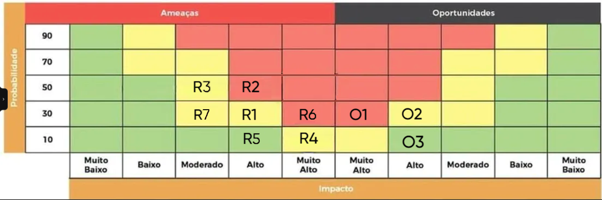

  Fonte - Imagem feita pelo grupo no Picsart (2026) 

#### Plano de ação para riscos do jogo

##### Riscos de produto e entrega para o parceiro 

R1. Falta de engajamento dos usuários com o jogo (30% de probablidade e impacto alto)

Como prevenir tal risco:
Realizar testes com os parceiros, com coleta de feedback contínuo.

Como resolver caso ocorra:
Ajustar mecânicas do jogo com base no feedback dos usuários.

R2. O jogo não reduzir efetivamente a evasão (50% de probabilidade e impacto alto)

Como prevenir tal risco:
Validação de hipóteses com base em dados e definição de métricas de retenção.

Como resolver caso ocorra:
Revisão das estratégias de engajamento e adaptação do jogo conforme os resultados obtidos.

##### Riscos de produção e desenvolvimento

R3. Problemas técnicos no desenvolvimento (50% de probabilidade e impacto moderado)

Como prevenir tal risco:
Realização de testes frequentes e uso de boas práticas de desenvolvimento.

Como resolver caso ocorra:
Correção contínua de bugs e melhoria da performance do sistema.

R4. Falta de tempo para finalizar o projeto (10% de probabilidade e impacto muito alto)

Como prevenir tal risco:
Planejamento ágil (sprints) e definição de um escopo mínimo viável (MVP).

Como prevenir tal risco:
Redução de fases para priorizar o bom funcionamento das fases já propostas.

R5. Desalinhamento com os objetivos da IBM (10% de probabilidade e impacto alto)

Como prevenir tal risco:
Revisões frequentes com membros da IBM e análise constante do problema proposto.

Como resolver caso ocorra:
Ajustes no direcionamento do projeto para manter aderência aos objetivos da empresa.

##### Riscos de inclusão

R6. Falta de acessibilidade e representatividade (30% de probabilidade e impacto muito alto)

Como prevenir tal risco:
Aplicação de testes de usabilidade e design centrado no usuário.
     
Como resolver caso ocorra:
Ajustes no jogo para garantir inclusão, acessibilidade e representatividade adequada.

##### Riscos de UX 

R7. Mecânicas de jogo não serem atrativas (30% de probabilidade e impacto moderado)

Como prevenir tal risco:
Benchmark com jogos educacionais e iteração constante de design.

Como resolver caso ocorra:
Reformulação das mecânicas com base em testes e feedback dos usuários.

##### Oportunidades

O1. Parceiro de projeto querer investir no projeto e financiar uma continuação do jogo para torna-lo completo (30% de probabilidade e impacto muito alto).

O2. Outras empresas analizarem o projeto e se interessarem pelo esquema proposto (30% de probabilidade e impacto alto).

O3  Disponiblizar o jogo em outras plataformas (10% de probabilidade e impacto alto).

### 1.1.7 Metas, Objetivos e Indicadores

As metas SMART ajudam a organizar melhor o projeto, deixando claro o que precisa ser feito, como será medido e em quanto tempo. No caso do Thinkers Journey, essa abordagem é importante para garantir não só a entrega do jogo, mas também que ele realmente ajude a melhorar o engajamento dos usuários em plataformas como a IBM SkillsBuild.

 #### Específica (S)

O jogo Thinkers Journey tem como objetivo diminuir a evasão dos cursos IBM Skills Build, por meio de uma proposta de game interativo e educativo, com foco em alunos universitários. Os cursos em questão possuem foco em IAs. O nosso objetivo é tornar os cursos sobre IA mais engajante e atrativo.

 Para alcançar essa meta o jogo vai mecânicas atrativas como:

Fases com mini games interativos
Implementação de conceitos de IA de uma forma simples e didática
Feedback sobre desempenho

Com essas mecânicas implementadas e o jogo finalizado, o foco será em fazer o jogo chegar nas mãos do público-alvo.

#### Mensurável (M)

Pra saber o impacto projeto foi positivo, a gente definiu alguns critérios:

Ter pelo menos 4 fases jogáveis
Ter um sistema de ascensão empresarial e progressão funcionando
Testar com parceiros de projeto e analisar os feedbacks
Ter um nível de satisfação de pelo menos 80%

 #### Alcançável (A)

A meta é possível porque a equipe adquiriu bastante conhecimento básico de desenvolvimento por meio dos auto estudos e orientações, e o  projeto foi pensado como um MVP, ou seja, focado no essencial.

Além disso:

O trabalho será dividido em partes menores (sprints), com metas de entrega em cada uma das 5
Cada membro terá uma função definida em cada sprint
Vamos usar ferramentas simples e funcionais

 #### Relevante (R)

Esse projeto é importante porque tenta resolver um problema real: muitas pessoas começam cursos online, mas acabam evadindo.
O Thinkers Journey busca mudar isso pensando em:

Tornar o aprendizado mais interessante e interativo
Usar elementos de jogos para motivar o usuário, como o sistema de ascensão na empresa, possuindo uma recompensa para o jogador
Criar uma experiência mais dinâmica e atrativa para nosso público-alvo

Isso está alinhado com a proposta da IBM SkillsBuild, que busca melhorar o acesso e a permanência nos cursos de IA

 #### Temporal (T)

O projeto será feito ao longo de 10 semanas, dividido em 5 sprints de 2 semanas:

Sprint 1: desenvolvimento da ideia principal do jogo e entrega do andar térreo
Sprint 2: entrega do primeiro mini game com o GDD sempre atualizado
Sprint 3: entrega do segundo mini game e começo do desenvolvimento das outras duas fases e andares 
Sprint 4: entrega dos últimos andares e mini games
Sprint 5: finalização do GDD e polimento do jogo para a entrega final

## 1.2. Requisitos do Projeto
"Os requisitos são as características que definem os critérios de aceitação de um produto" (PAULA FILHO, 2000, seção 2.3). Isto é, os requisitos do jogo são o conjunto de todas as propriedadades, capacidades e funcionalidades que somam as necessidades conceituais e técnicas para o seu correto funcionamento. Com a devida associação de interesses, alinha-se as necessidades do parceiro, do público alvo e da equipe de desenvolvimento na criação de requisitos que atendam as temáticas. Por meio deles, estabelecem-se métricas que estruturam desde a aquitetura lógica do projeto até os critérios de qualidade e o escopo prático.

\#R | Requisitos 
--- | ---
R01 | O jogo deve apresentar controles para as teclas WAD visando à navegação pelas fases
R02 | O jogo deve apresentar uma tela inicial para a introdução
R03 | O jogo deve possuir uma tela de tutorial, que mostre todos comandos que serão úteis
R04 | O jogo deve apresentar um sistema que permite o ajuste do volume do som
R05 | O jogo deve apresentar áudios interativos e adaptativos, a fim de melhorar a experiência
R06 | O jogo deve apresentar 4 andares, cada um contendo um minigame que ensine um conceito sobre IA
R07 | O jogo deve possuir sprites de personagem, interações do jogador com o cenário e personagens não jogáveis
R08 | O jogo deve possuir uma interface com design intuitivo que facilite a experiência da gameplay
R09 | O jogo deve permitir pausar e retomar a gameplay a qualquer momento.
R10 | O jogo deve possuir diálogos injuntivos e educativos
R11 | O jogo deve possuir um elevador que possibilita a transição de andares para marcar uma transição de cenário
R12 | O jogo deve possir diálogos que ensinem conceitos de IAs para o jogador
R13 | O jogo deve apresentar minigames interativos que desafiem o jogador a usar os conceitos ensinados durante a gameplay
R14 | O jogo deve apresentar mensagens de erro quando o jogador falhar
R15 | O jogo deve possuir documentação apresentando o arcabouço técnico
R16 | O jogo deve representar as diversidades
R17 | O jogo deve proibir o jogador de avançar, caso ele não tenha jogado algum minigame prévio
R18 | O jogo deve apresentar um desfecho que parabenize o jogador pela conclusão
R19 | O jogo deve apresentar mensagens de erro ou orientação quando o jogador falhar

## 1.3. Público-alvo do Projeto 

Nosso público-alvo é formado por estudantes universitários da área de tecnologia, principalmente entre 17 e 23 anos. Esse grupo já convive diariamente com inteligências artificiais, seja em estudos, trabalho ou uso pessoal, mas muitas vezes sem compreender de fato como essas tecnologias funcionam. São pessoas curiosas, conectadas e com interesse em aprender coisas novas, especialmente quando enxergam valor disso para o futuro profissional.

Ao mesmo tempo, é um público que tende a se desengajar com métodos tradicionais de ensino, como conteúdos longos e muito teóricos. Existe uma preferência clara por experiências mais dinâmicas, interativas e práticas, o que abre espaço para soluções baseadas em gamificação. Nesse sentido, o jogo se propõe a transformar o aprendizado em algo mais leve e envolvente, diminuindo a barreira inicial que muitos têm ao estudar inteligência artificial.

Além disso, o interesse por IA cresce junto com as oportunidades no mercado. Segundo o Jornal da USP, a tecnologia pode gerar cerca de 2,7 milhões de empregos líquidos apenas no Reino Unido até 2037, reforçando a importância desse conhecimento. Assim, o projeto conversa diretamente com um público que quer se preparar melhor para o mercado, mas que busca formas mais interessantes e acessíveis de aprender.

# 2. Visão Geral do Jogo

## 2.1. Objetivos do Jogo

O Thinkers Journey tem por objetivo transmitir o conteúdos dos cursos do IBM SkillsBuild de forma dinâmica e interativa para usuário, por meio de uma narrativa fluida que engaje o jogador a chegar ao final dos andares, absorvendo os conceitos abordados e aplicando-os nas tarefas encontradas nos minigames.

  O jogo segmenta-se em seis momentos: ida à empresa, térreo, primeiro, segundo, terceiro e quarto andares.

  Na cena inicial, o jogador é contextualizado com uma cutscene acerca do recorte a que o jogo propõe: uma universitária indo à empresa para iniciar seu primeiro dia de trabalho.

  Depois que a personagem - cujo nome é Ana - entra no prédio da Thinkers, inicia-se a cena do térreo, no qual Ana terá uma breve conversa injuntiva com a recepcionista a fim de saber seus próximos passos, e, após essa interação, o primeiro andar será liberado.

  No primeiro andar, o jogador deve interagir com uma supervisora e seu objetivo é aprender o que são IAs, como elas estão envolvidas no cotidiano e a distinção entre as suas potencialidades em relação às potencialidades humanas. A fixação desses conhecimentos dá-se por meio de um minigame estilo drag and drop, que, após sua conclusão, a supervisora concede a subida de cargo na empresa e de andar.

  O segundo andar tem por objetivo ensinar ao jogador o que é Machine Learning, por meio de uma crise no sistema empresarial - contaminado por um vírus. Para resolver o problema, o jogador executa um minigame estilo drag and drop, adquirindo conhecimento sobre o reconhecimento de padrões feitos pela IA e a lógica do seu processo de treinamento (Machine Learning). Concluído esse minigame, o jogador irá lutar com um vírus que contaminou os dados da empresa, liberando, após o sucesso, o terceiro andar.

  Ao alcançar o terceiro andar, o jogador estabelece um diálogo com seu assistente, que tem por finalidade fornecer uma compreensão acerca de Deep Learning,  funcionamento de agentes de IA e  identificação de vieses algorítmicos. A dinâmica de aprendizagem ocorre por meio de um minigame de conexão de conceitos, cujo propósito narrativo é restaurar a memória de um Agente de IA. Com a correta associação das ideias e a superação dos desafios propostos, o assistente direciona a personagem ao último estágio da jornada.
  
  No quarto andar, a protagonista - agora investida de um cargo de maior responsabilidade - é recebida pela coordenadora-chefe para tratar de ética no uso de inteligência artificial. O andar foca na diversidade de setores em que as IAs estão presentes, como elas podem ser utilizadas e tem por objetivo mostrar a importância de decisões humanas em ambientes que necessitam de validação ética. Para ensinar isso, o desafio prático consiste na análise e avaliação de relatórios de conduta de outros funcionários da empresa, nos quais o jogador deve discernir entre práticas éticas e antiéticas no ambiente corporativo. Com um desempenho satisfatório na análise, culmina-se na cutscene final do jogo, que encerra a narrativa parabenizando o usuário pela conclusão do percurso e pela absorção dos conteúdos fundamentais do IBM SkillsBuild.

## 2.2. Características do Jogo 

### 2.2.1. Gênero do Jogo 

O Thinkers Journey é classificado como um Serious Game, focado em educação e treinamento corporativo. Diferentemente de um jogo comum, seu objetivo central não é apenas o entretenimento, mas sim a transmissão de conhecimento técnico e a simulação da progressão de carreira dentro da Thinkers. O jogo utiliza a gamificação para transformar o aprendizado de conceitos complexos de IA em uma experiência prática e interativa.
A estrutura do gameplay combina diversos gêneros. O primeiro é o RPG, presente na evolução da personagem que começa como estagiária e sobe na hierarquia da empresa conforme ganha experiência. Essa progressão é acompanhada por elementos de Simulação, que reproduzem o ambiente de uma Big Tech.
A navegação da história segue o estilo de Aventura Narrativa, onde o jogador interage com NPCs para entender a cultura da Thinkers e os objetivos de cada andar. Por fim, o núcleo do desafio técnico acontece por meio de Puzzles (Minigames). Nesses momentos, o jogador precisa aplicar conhecimentos de Inteligência Artificial para resolver problemas específicos e conquistar sua promoção para o próximo nível.

### 2.2.2. Plataforma do Jogo 

A experiência do jogo é limitada ao uso via computador.

### 2.2.3. Número de jogadores 

Nosso jogo foi pensado para um player, considerando todas as dinâmicas e jogabilidade, uma vez que o objetivo do jogo é apresentar um processo de aprendizado e ascensão empresarial.

### 2.2.4. Títulos semelhantes e inspirações 

O desenvolvimento do Thinkers Journey foi norteado por benchmarks da indústria que aportaram subsídios para diferentes camadas da experiência, expandindo o repertório da equipe quanto ao fluxo de fases, à ambientação e às mecânicas de minigames.

Na progressão das fases, “Tiny Tower” serviu de referência para a ascensão vertical. Nesse jogo, a evolução do jogador é representada pela subida de andares, simbolizando conquista; analogamente, no Thinkers Journey, essa mecânica traduz o crescimento profissional e a aquisição de competências.

Quanto à ambientação, “Game Dev Story” influenciou a intersecção entre o cenário corporativo e a estética lúdica. A premissa de evoluir em uma estrutura organizacional, desbloqueando habilidades, foi adaptada para criar uma jornada imersiva no ecossistema tecnológico.

Para as mecânicas de puzzle, “while True: learn()” inspirou o modelo de conexão semântica voltado ao treinamento de IAs. A lógica de manipular fundamentos de Machine Learning para progredir foi fundamental para a concepção do level design das fases mais técnicas.

Por fim, “Hollow Knight” serviu de paradigma para a cinemática da personagem e exploração 2D, provendo referências importantes sobre responsividade e senso de descoberta na navegação dos espaços.

A sintetização dessas referências permite que o Thinkers Journey alie convenções sedimentadas no mercado a uma proposta pedagógica própria, trazendo a curva de aprendizado para uma experiência interativa e engajante.

# 3. Game Design

## 3.1. Enredo do Jogo

 A personagem principal é Ana, uma estudante universitária que conquista uma vaga de estágio na empresa Thinkers e inicia seu primeiro dia de trabalho. Ao chegar ao prédio, ela é recepcionada por uma recepcionista no térreo, que apresenta o ambiente e introduz o contexto da sua jornada profissional. Em seguida, ao subir pelo elevador, Ana encontra seu chefe, que a direciona para suas primeiras atividades dentro da empresa.
No primeiro andar, a personagem tem seu primeiro contato com conceitos básicos de inteligência artificial, apresentados por meio de diálogos e um minigame introdutório. Ao completar esse desafio, Ana é promovida e passa a atuar como desenvolvedora de IA no segundo andar, onde se aprofunda em temas como machine learning, enfrentando um novo desafio prático relacionado a uma crise no sistema da empresa.
A progressão continua até o terceiro e quarto andar, que representam etapas mais avançadas da carreira. No terceiro andar, Ana assume um papel mais analítico, trabalhando com conceitos relacionados a dados e sua qualidade, aplicados em um novo minigame. Já no quarto andar, a personagem atinge um nível mais estratégico dentro da empresa, sendo responsável por tomar decisões envolvendo o uso de diferentes tipos de inteligência artificial, além de refletir sobre impactos éticos e sociais no contexto corporativo

## 3.2. Personagens

### 3.2.1. Controláveis: Ana, a protagonista
Nossa personagem principal chama-se Ana, ela é a única personagem controlável do jogo. Ana é uma mulher negra conhecida por ser dinâmica e curiosa. Ela gosta de estar atualizada de novas tecnologias, e valoriza o domínio técnico e profundo das potencialidades da IA. Como acadêmica de sistema de informação, Ana acredita no aprendizado prático e sente que tem muito potencial para atingir cargas de liderança em inteligência artificial. Objetivos: Aprender sobre IA e suas aplicações para realizar seu sonho de trabalho na grande empresa Thinkers.

  
  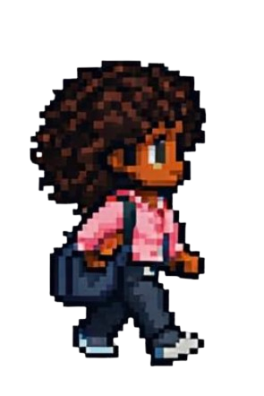
  
  Fonte - Elaborado pelos autores (2026) 

### 3.2.2. Non-Playable Characters (NPC)
No jogo, existem seis NPCs, sendo eles a recepcionista do prédio, o chefe da empresa Thinkers, a supervisora do 1° andar, o supervisor do 2° andar, o funcionário do 3° andar e a coordenadora de ética do 4º andar

#### 3.2.2.1 Recepcionista do hall: Adriana

  Figura 01

  

  Fonte - Elaborado pelos autores (2026) 

Adriana é uma personagem simpática, acolhedora e sempre disposta a ajudar, transmitindo confiança logo no primeiro contato com o jogador. Ela apresenta o ambiente da empresa e guia o personagem de forma clara e amigável, tornando a experiência inicial mais leve. Sua comunicação é simples, incentivando o jogador a seguir na jornada. Além disso, sua postura prestativa reforça a sensação de acolhimento dentro do universo do jogo.

#### 3.2.2.2. Chefe da Thinkers: Fabio

  Figura 02 

  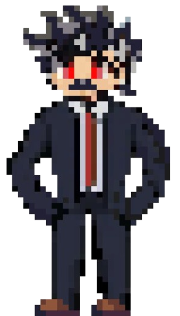

  Fonte - Elaborado pelos autores (2026) 

Fabio apresenta uma postura mais exigente, transmitindo responsabilidade e seriedade em suas interações, mas sem deixar de ser calmo e justo com o jogador. Ele atua como uma figura de orientação, explicando com clareza as tarefas que devem ser realizadas e o que se espera do desempenho do personagem. Sua comunicação é direta e objetiva, reforçando a importância das atividades propostas. Ao mesmo tempo, demonstra confiança no potencial do jogador, incentivando seu crescimento dentro da empresa.

#### 3.2.2.3. Supervisora do 1° andar: Zara

  Figura 03

  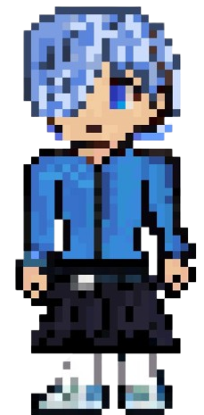

  Fonte - Elaborado pelos autores (2026) 

Zara é uma profissional segura, didática e acolhedora, que transmite confiança ao apresentar os primeiros conceitos de inteligência artificial ao jogador. Sua comunicação é clara e acessível, facilitando o entendimento mesmo para quem está tendo o primeiro contato com o tema. Como mulher trans, sua presença também reforça a diversidade dentro da empresa, contribuindo para um ambiente mais inclusivo e representativo. Além de ensinar os fundamentos da IA e suas aplicações no dia a dia, ela incentiva o jogador a aprender sem medo, valorizando a curiosidade e o desenvolvimento contínuo.

#### 3.2.2.4. Supervisor do 2° andar: Gustavo

  Figura 04

  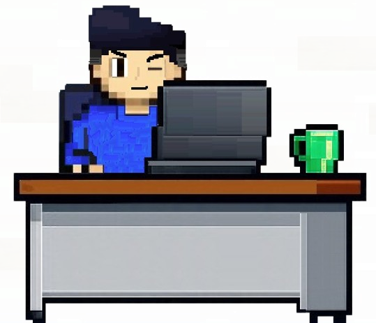

  Fonte - Elaborado pelos autores (2026) 

Gustavo é uma pessoa calma e centrada, que transmite segurança mesmo em situações de pressão. Sua principal característica é a capacidade de analisar problemas com clareza e conduzir a equipe até uma solução viável, mantendo o controle mesmo em momentos de crise. Ele orienta o jogador de forma tranquila, apresentando o treinamento de uma inteligência artificial como a principal tarefa da personagem. Sua postura reforça a importância de organização, lógica e tomada de decisão no ambiente de trabalho.

#### 3.2.2.5. Funcionário do 3° andar: Lucas

  Figura 05

  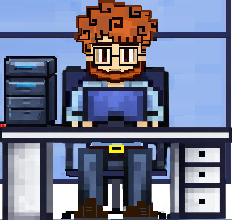

  Fonte - Elaborado pelos autores (2026) 

Lucas é um desenvolvedor analítico e preciso, conhecido por resolver problemas complexos com eficiência. Ele possui um raciocínio lógico forte e uma abordagem metódica, sempre buscando entender profundamente os modelos de IA. Apesar de mais reservado, se mostra um ótimo mentor, ajudando quem realmente quer aprender. No terceiro andar, orienta o jogador no treinamento de IA, incentivando boas práticas e evolução contínua.

#### 3.2.2.6. Coordenadora de Ética do 4º andar: Renata

  Figura 06

  

  Fonte - Elaborado pelos autores (2026) 

Renata é uma coordenadora de ética com uma postura firme, crítica e muito bem informada sobre o impacto da inteligência artificial na sociedade. Como mulher negra, sua presença também reforça a importância da representatividade e da diversidade dentro da área de tecnologia. Ela analisa situações com profundidade, especialmente quando envolvem decisões automatizadas e uso de dados. No quarto andar, orienta o jogador a tomar decisões responsáveis, mostrando que a ética em IA depende tanto da tecnologia quanto das escolhas humanas.

### 3.2.3. Diversidade e Representatividade dos Personagens

#### Contexto

Antes de falar sobre os personagens, é preciso entender o cenário duplo que Thinkers Journey habita: o mercado de jogos e o mercado de tecnologia. Os dois compartilham a mesma contradição estrutural - públicos cada vez mais diversos sendo servidos por indústrias ainda dominadas por um perfil muito específico de pessoa.
Segundo a Pesquisa Game Brasil (PGB) 2024, que ouviu mais de 13 mil pessoas em todo o território nacional, negros representam a maioria étnica entre os jogadores brasileiros, somando 52,3% do público, entre pardos e pretos. O público feminino, por sua vez, representa 50,9% dos jogadores. Ainda assim, estudos sobre grandes títulos globais como World of Warcraft, League of Legends e Dota 2 revelam uma sistemática sobrerrepresentação de homens brancos e sub-representação de mulheres e pessoas não-brancas nos personagens.
No setor de tecnologia, onde o jogo é ambientado, o quadro é igualmente descompassado. O primeiro Censo de Diversidade do setor de TIC, realizado pela Brasscom, mostra que apenas 34,2% dos profissionais são mulheres, contra 63,1% de homens. No aspecto étnico-racial, 62,1% dos colaboradores são brancos. Mulheres negras são ainda mais sub-representadas: respondem por apenas 11,5% do total de profissionais no setor. Nos cargos de liderança, a hegemonia branca se aprofunda - 69% dos homens e 72,7% das mulheres em posições de chefia são brancos. 
É dentro dessa dupla lacuna - de representação nos jogos e de representação na tecnologia - que os personagens de Thinkers Journey surgem não como adornos, mas como argumentos.

#### Ana: a protagonista como espelho possível
Ana, a protagonista do jogo, é uma mulher negra em ascensão dentro de uma empresa de inteligência artificial. Sua criação parte de uma referência concreta e deliberada: Nina da Hora, cientista da computação brasileira, pesquisadora de ética em IA e fundadora do Instituto da Hora. Nina da Hora é conhecida por sua pesquisa sobre ética e racismo algorítmico, e utiliza sua posição para combater sistemas de exclusão e construir tecnologias mais justas para populações negras e indígenas no Brasil. Crescida na periferia de Duque de Caxias, ela quebrou barreiras para se tornar referência nacional em segurança digital e antirracismo computacional.
A escolha por ancorar Ana em uma figura real como Nina da Hora não é apenas homenagem - é um gesto epistemológico. Significa dizer ao jogador que mulheres negras existem, lideram e transformam a área de tecnologia, ainda que os dados mostrem o quanto esse caminho ainda é obstruído. Apesar de a população negra representar 55,5% dos brasileiros segundo o último censo do IBGE, apenas 29,6% dos profissionais de tecnologia se identificam como negros.
Para o jogador ou jogadora que pertence a um grupo sub-representado, ver Ana como protagonista ativa o que a psicologia social chama de identificação narrativa: o processo pelo qual o sujeito se projeta na experiência do personagem e amplia sua percepção de possibilidade. Pesquisas sobre representatividade em jogos digitais trazem dados empíricos que demonstram o quanto a presença de personagens representativos faz diferença concreta na vida das pessoas, especialmente para públicos historicamente invisibilizados na mídia. Para quem não pertence a esses grupos, Ana cumpre outro papel igualmente valioso: o de tornar familiar aquilo que o cotidiano insiste em tornar exceção.

#### Zara: supervisora Trans como normalidade corporativa

Zara ocupa o cargo de supervisora do primeiro andar - uma posição de liderança intermediária, de gestão cotidiana, de autoridade legítima. Essa escolha narrativa é sofisticada, pois Zara não é inserida como personagem-símbolo de pauta, mas como profissional exercendo sua função e esse enquadramento importa.
Um estudo de 2024 realizado pela organização To.gather, com 289 empresas brasileiras e 1,5 milhão de trabalhadores, revelou que apenas 0,9% dos empregados eram pessoas trans ou travestis. Em postos de liderança, esse número cai para 0,2%. Dados da FAPESP levantados em 2020 indicam que apenas 13,9% das mulheres trans e travestis possuem empregos formais no Brasil.
Diante desse cenário, colocar Zara em uma posição de supervisão em uma empresa de IA não é romantismo - é uma provocação ao status quo. O jogador que interage com ela ao longo da jornada de Ana é convidado a naturalizar algo que os números mostram ser ainda raro: uma mulher trans exercendo liderança em ambiente corporativo de tecnologia, sendo respeitada e reconhecida por sua competência. O GLAAD Gaming Report 2024 aponta que 72% dos jogadores LGBTQIA + ainda esperam ver mais representações positivas e reais nos jogos, e que cerca de 70% desse público evita títulos que reforcem preconceitos. Sinergicamente, a presença de Zara também cumpre uma função de empatia estruturada para jogadores cisgênero. Ao interagir com uma personagem trans complexa, com função narrativa e autoridade dentro do jogo, o jogador é colocado numa posição de convívio - e convívio, mesmo que ficcional, é uma das formas mais eficazes de redução de preconceito demonstradas pela psicologia social.

#### Renata: a Ética não é neutra, e quem a define importa

Renata ocupa um cargo central para a proposta de Thinkers Journey: coordenadora de ética. Ela também é uma mulher negra. Essa combinação não é acidental, e seu impacto na experiência do jogador opera em uma camada mais sutil do que a representação visual.
A área de ética em IA é, hoje, um dos campos mais estratégicos e politicamente disputados do setor de tecnologia. Algoritmos de reconhecimento facial, sistemas de crédito automatizados, plataformas de contratação por IA - todos esses sistemas carregam vieses que afetam desproporcionalmente populações negras, mulheres e grupos marginalizados. A própria Nina da Hora, referência de Ana, relatou ter se deparado com sistemas de reconhecimento facial que não reconheciam seu rosto ao início de sua carreira - episódio que a levou a expandir sua pesquisa para a interface entre tecnologia e sociedade, com foco em vieses raciais no aprendizado de máquinas.
Ao posicionar Renata como a voz ética da empresa dentro do jogo, Thinkers Journey comunica algo que vai além da representatividade: comunica que a perspectiva de pessoas negras não é apenas bem-vinda na tecnologia, ela é necessária para que a tecnologia seja justa. Quando menos de 19% dos profissionais responsáveis por desenvolver sistemas tecnológicos são mulheres, há um risco real de que serviços amplamente utilizados por elas sejam projetados sem a perspectiva de quem mais depende deles - e o mesmo raciocínio se aplica à ausência de pessoas negras nas equipes.
Para o jogador, Renata encarna a tese central do jogo de forma personificada: a IA não é neutra porque quem a constrói não é neutro.

#### Adriana, Fábio, Gustavo, Lucas: a diversidade é sobre o todo, não apenas identidades marginalizadas

Um dos equívocos mais recorrentes no design de elencos comprometidos com a representatividade é tratar diversidade como sinônimo de substituição - como se incluir personagens de grupos historicamente marginalizados exigisse apagar ou diminuir os demais. Thinkers Journey recusa essa lógica. Adriana, Gustavo, Lucas e Fábio são personagens brancos com funções centrais na narrativa, e sua presença no jogo não enfraquece o argumento de diversidade do elenco: ela o completa.
O que define um elenco verdadeiramente plural não é a ausência de determinados perfis, mas a recusa de que apenas um perfil carregue complexidade, autoridade e profundidade. Durante décadas, a indústria de jogos construiu mundos onde homens brancos eram os protagonistas, os líderes, os especialistas e os árbitros morais - enquanto personagens de outros grupos apareciam como coadjuvantes, estereótipos ou alegorias. Thinkers Journey inverte essa lógica não eliminando personagens brancos, mas distribuindo poder narrativo de forma equânime entre todos.
Fábio é o chefe da empresa. Exigente, justo e direto, ele representa a figura de maior autoridade hierárquica dentro do jogo - e é um homem branco. Adriana é o primeiro contato do jogador com o universo da Thinkers: acolhedora, clara e orientadora, ela estabelece o tom da experiência no início. Lucas carrega o perfil técnico e analítico que o imaginário coletivo associa automaticamente à área de tecnologia. Gustavo conduz o treinamento de inteligência artificial com calma e precisão, sendo referência de competência sob pressão. Nenhum desses papéis foi esvaziado para dar lugar à diversidade - todos existem com a mesma densidade com que existem Ana, Zara e Renata.
É exatamente aí que reside o argumento. Quando Fábio, como chefe branco, divide a cena de autoridade com Renata, coordenadora de ética e mulher negra, o jogo não está fazendo uma concessão - está descrevendo como um ambiente de trabalho justo deveria funcionar. Quando Gustavo, homem gay branco, conduz o treinamento ao lado de Ana, mulher negra inspirada em Nina da Hora, nenhum dos dois precisa ceder espaço para que o outro exista. Quando Adriana acolhe o jogador num universo onde Zara, mulher trans, exerce supervisão, a mensagem não precisa ser verbalizada: pertencimento não é recurso escasso.
Essa escolha de design também responde a uma crítica legítima que narrativas de diversidade frequentemente enfrentam: a de que personagens de grupos majoritários são reduzidos a figuras sem substância para que o elenco pareça mais inclusivo. Em Thinkers Journey, Adriana, Gustavo, Lucas e Fábio têm funções dramatúrgicas sólidas, personalidades distintas e papéis insubstituíveis na jornada do jogador. Eles não estão no jogo apesar da proposta de diversidade - estão no jogo como parte dela.
O mercado de tecnologia real é majoritariamente branco. Ignorar isso no design do jogo seria uma fantasia. Reproduzi-lo sem crítica seria uma omissão. Thinkers Journey faz uma terceira coisa: representa esse mercado como ele poderia ser - um espaço onde homens e mulheres brancos, negros, trans e LGBTQIA+ constroem juntos, com igual legitimidade, sem que a presença de uns justifique a ausência dos outros.

#### Conclusões

Os games têm aparecido com maior frequência no cotidiano, e a construção de identidade faz parte explícita do estilo de vida dos jogadores digitais. Isso significa que os personagens com os quais os jogadores interagem ao longo de horas de imersão funcionam como modelos cognitivos - não no sentido ingênuo de "o jogo vai mudar minha vida", mas no sentido documentado de que a ficção é um dos espaços onde imaginamos possibilidades que ainda não vemos no real.
Para uma jovem negra que nunca viu uma protagonista como ela em um jogo de tecnologia, Ana pode ser o primeiro espelho. Para um jovem branco que nunca trabalhou ao lado de uma pessoa trans, a convivência com Zara pode ser a primeira experiência segura de desconstrução de estranhamento. Para um profissional de TI que nunca pensou sobre quem define os critérios éticos dos sistemas que constrói, Renata é uma pergunta que o jogo coloca sem precisar verbalizá-la.
Thinkers Journey não ensina diversidade como lição. Apresenta diversidade como realidade - uma realidade que já existe fora do jogo, que os dados mostram ser ainda insuficiente dentro das empresas de tecnologia, e que pode ser praticada, reconhecida e valorizada dentro da experiência lúdica antes de ser encontrada no mercado de trabalho.

## 3.3. Mundo do jogo

### 3.3.1. Locações Principais e/ou Mapas
 

#### **Cidade**
Cidade onde se localiza o prédio da Thinkers, que ambiente o contexto urbano da localização da empresa

  Figura 01 - Tela Inicial

  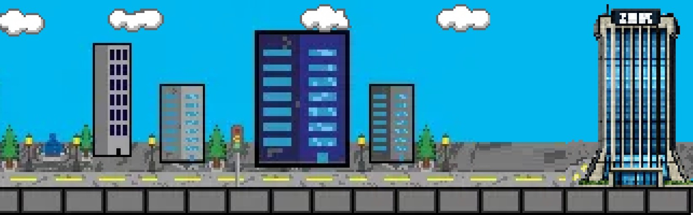
  
  Fonte - Elaborado pelos autores (2026) 

#### **Hall**
Hall ou térreo do prédio da empresa onde o jogador irá imergir a partir da entrada, nele estão presente os elementos visuais que simbolizam os valores da Thinkers, os quais, também, são valores correntes da gameplay do usuário

  Figura 02 - Térreo

  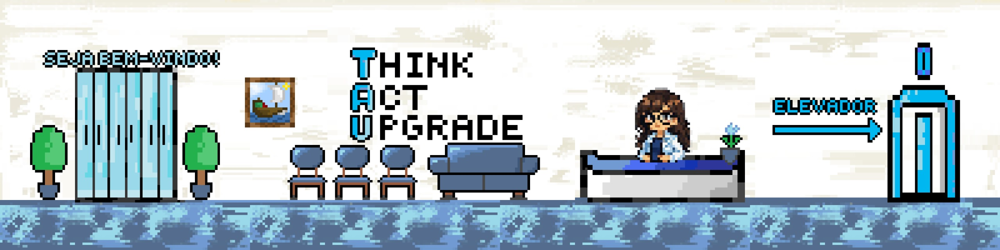>

  Fonte - Elaborado pelos autores (2026) 

#### **Elevador**

O elevador marca o momento onde a personagem está transitando do térreo para o andar onde ocorre o trabalho propriamente dito na Thinkers.

  Figura 03 - Elevador

  

  Fonte - Elaborado pelos autores (2026) 

#### **Primeiro andar**
Ambiente onde, de fato, o trabalho na empresa começa, nele estão outros funcionários, a supervisora do andar e onde o chefe passa para receber os novos contribuintes da Thinkers. Aqui, o jogador receberá suas primeiras intruções educativas da gameplay.

  Figura 04 - Primeiro andar

  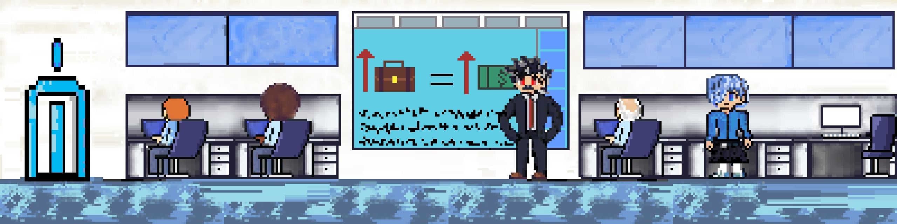

  Fonte - Elaborado pelos autores (2026) 

#### **Segundo andar - Durante a Crise**
No segundo andar da empresa, o jogador se depara com uma crise causada por um malware que se instalou nos servidores da Thinkers e ameaça excluir todos os dados que lá estão. Nesse andar, o se aprofunda em IA para aprender o que é machine learning para solucionar o problema.

  Figura 05 - Segundo andar

  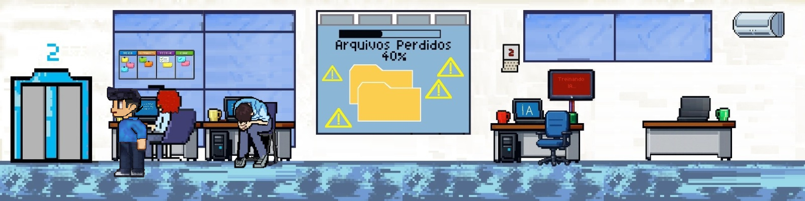

  Fonte - Elaborado pelos autores (2026) 

#### **Segundo andar - Pós a Crise**
Com a crise solucionada, o cenário se torna mais leve e o jogador, após ser o responsável por maior parte da solução do problema, é promovido novamente, podendo acessar o terceiro andar da thinkers.

  Figura 06 - Segundo andar (pós crise)

  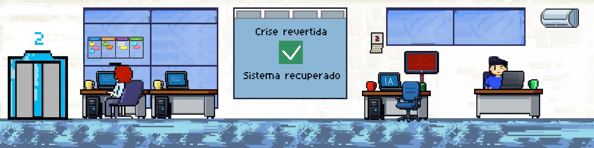

  Fonte - Elaborado pelos autores (2026) 

#### **Terceiro andar**
No terceiro andar da empresa, o jogador se encontrará com um assistente, que o informa da situação do Thk.bot, uma IA que foi corrompida pelo vírus, que deverá ser concertada pelo jogador.

  Figura 06 - Terceiro andar

  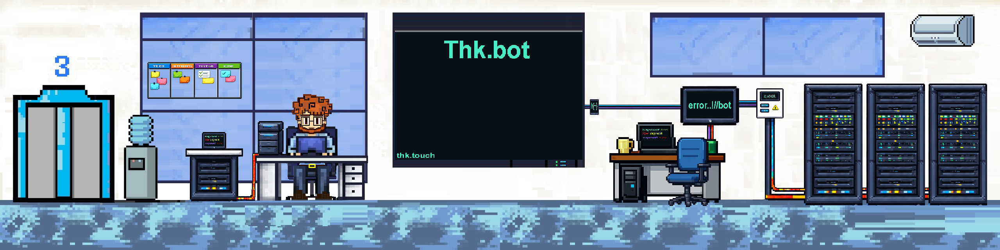

  Fonte - Elaborado pelos autores (2026) 

#### **Quarto andar**
No quarto andar, situa-se o Comitê de Ética da empresa. Lá, a coordenadora chefe irá solicitar ao jogador para avaliar alguns relatórios que contém ações tanto ruins, quanto boas de certos funcionários da empresa.

  Figura 06 - Quarto andar

  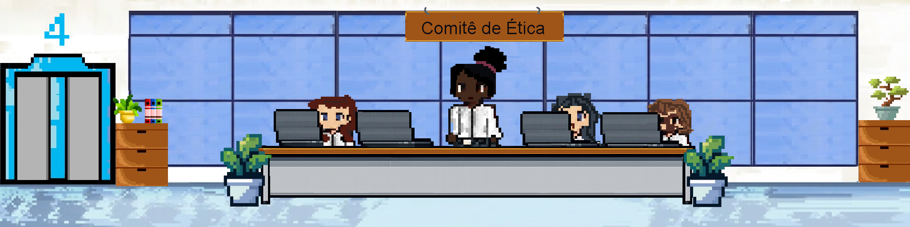

  Fonte - Elaborado pelos autores (2026) 

### 3.3.2. Navegação pelo mundo

#### 3.3.2.1. - Térreo
Primeira cena navegável pelo jogador, caminhando no prédio da Thinkers.

  Figura 01 -Navegação pelo térreo 

  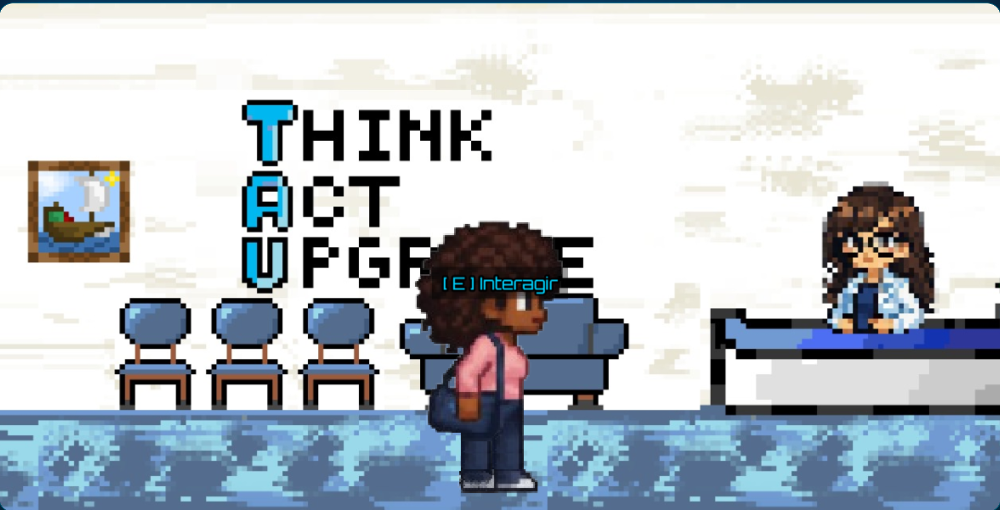

  Fonte - Elaborado pelos autores (2026) 

#### 3.3.2.2. - Primeiro andar
Segunda cena navegável pelo jogador, caminhando no primeiro andar de contribuintes do prédio da Thinkers.

  Figura 02 -Navegação pelo 1o andar 

  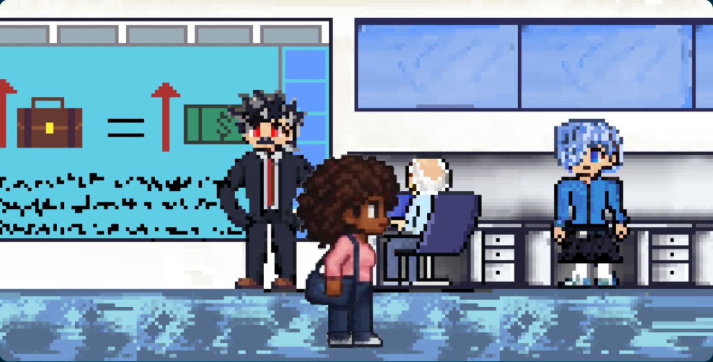

  Fonte - Elaborado pelos autores (2026) 

#### 3.3.2.3. - Segundo andar
Terceira cena navegável pelo jogador, caminhando no segundo andar de funcionários do prédio da Thinkers.

  Figura 03 -Navegação pelo 2o andar 

  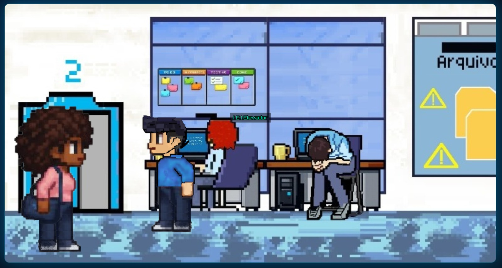

  Fonte - Elaborado pelos autores (2026) 

#### 3.3.2.4. - Cena do vírus 
Nesta cena, a personagem dirige-se ao vírus para derrotá-lo após concluir o treinamento da IA que foi usada para caçá-lo.

  Figura 04 -Navegação pela fase do vírus 

  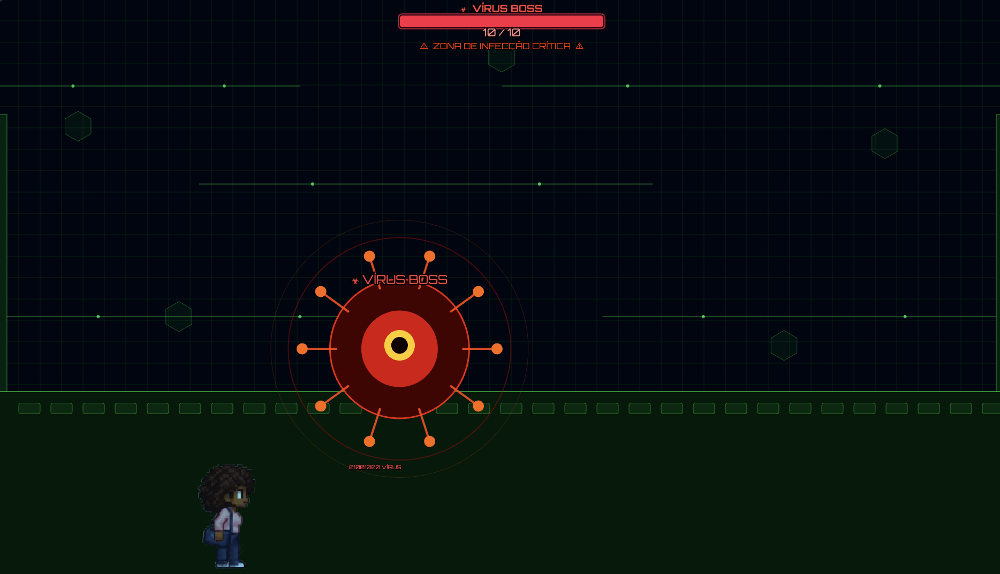

  Fonte - Elaborado pelos autores (2026) 

#### 3.3.2.5 - Terceiro andar
Nesta cena, o jogador deverá conversar com o assistente e concertar a IA que foi corrompida pelo vírus.

  Figura 04 -Navegação pela 3o andar 

  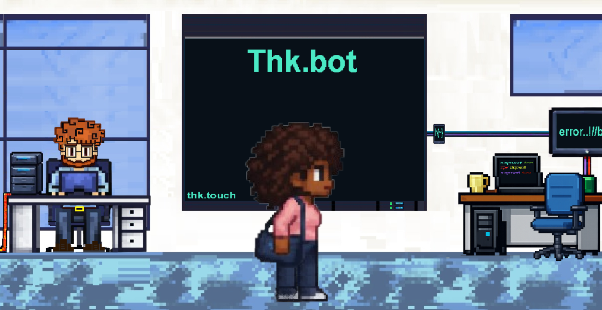

  Fonte - Elaborado pelos autores (2026) 

 
#### 3.3.2.6 - Quarto andar
Nesta cena, o jogador deverá ajudar a equipe do comitê de ética a avaliar os relatórios dos funcionários da empresa.

  Figura 04 -Navegação pela 4o andar 

  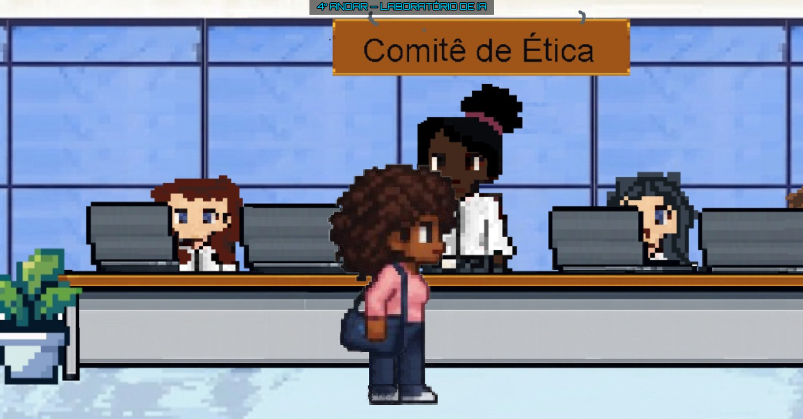

  Fonte - Elaborado pelos autores (2026) 

### 3.3.3. Condições climáticas e temporais

O jogo ambienta-se, preponderantemente, em ambientes fechados, isto é, no prédio da Thinkers, transitando entre os andares. Portanto, não existem condições climáticas distintas entre todas as cenas, com exceção da cena da personagem movendo-se à empresa, no qual o ambiente é uma cidade de clima ensolarado.

### 3.3.4. Concept Art

#### **Logo**

Primeira ideia de logo do jogo desenvolvida pela equipe

  

  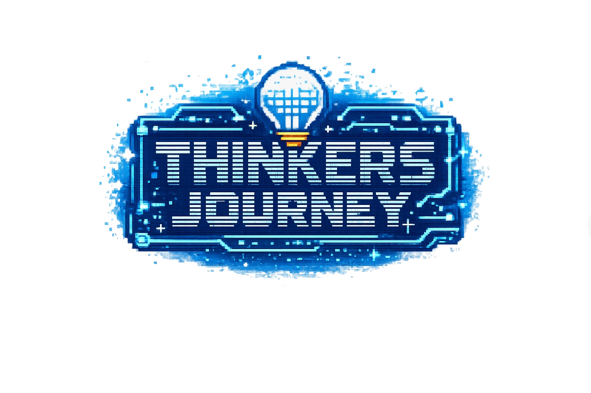

  Fonte - Elaborado pelos autores (2026) 

#### **Sprites iniciais**

Desconstrução inicial que serviu de base para o desenvolvimento posterior da personagem presente na gameplay

   

  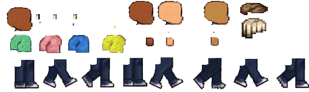
  
  Fonte - Elaborado pelos autores (2026) 

#### **Manequim de NPCs**

Manequim que serviu de base para o desenvolvimento geral de todos os NPCs presentes no jogo

  
  

  Fonte - Elaborado pelos autores (2026) 

## 3.4. Inventário e Bestiário 

### 3.4.1. Inventário

No contexto deste jogo, o sistema de inventário implementado é minimalista e diegético, sendo representado pelo crachá corporativo da personagem. Esse elemento funciona como um registro dinâmico de progressão, armazenando informações-chave como nome, identificação (ID) e cargo atual na empresa. O sistema concentra-se na atualização incremental desse único objeto, refletindo diretamente a evolução da personagem ao longo dos andares do jogo. A cada avanço, o crachá é automaticamente atualizado para um novo nível hierárquico, integrando-se às mecânicas de progressão e narrativa, e atuando como indicador visual e funcional do status do jogador dentro do ambiente corporativo simulado.

N° | Momento do jogo  | Crachá |        Contexto
--- | --- | --- | ---
1|Pré-recepcionista|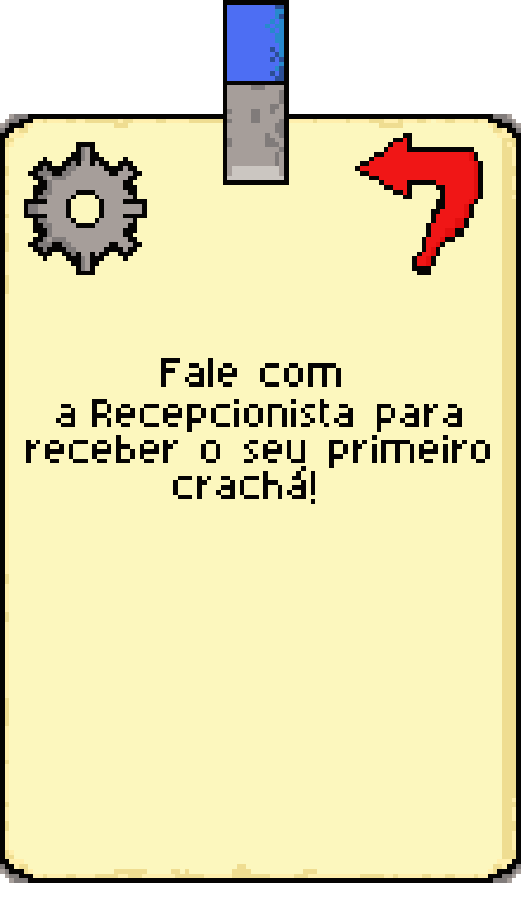|Crachá antes da interação do jogador com a recepcionista
2|Pós-recepcionista||Crachá após a interação do jogador com a recepcionista, recebendo o cargo de Estagiária, o qual é a primeira função atribuída à personagem, acompanhando-a até o 1° andar.
3|2° andar|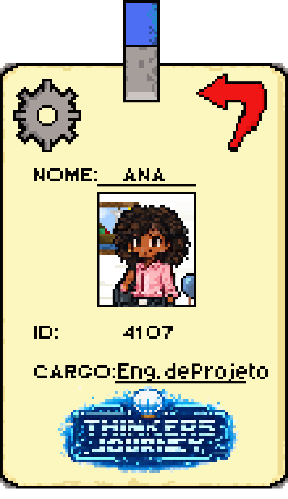| Crachá da personagem após subir para o 2° andar, onde ela adquire o cargo de Engenheira de Projetos.
4|3° andar|| Crachá da personagem após subir para o 3° andar, onde ela adquire o cargo de Especialista em IA.
5|4° andar|| Crachá da personagem após subir para o 4° andar, onde ela adquire, naquele momento, o máximo cargo da Thinkers: Analista de Ética.

### 3.4.2. Bestiário

Ao término da terceira sprint, o jogo apresenta um inimigo implementado, o vírus presente no segundo minigame, sua função é ser uma representação metafórica do malware que se instaurou no sistema. Sua presença tem uma função mais simbólica que literal, tornando mais fácil a visualização do jogador sobre o que está acontecendo na cena. Durante sua aparição, o jogador o "ataca", fazendo com que o vírus desapareça.

  
  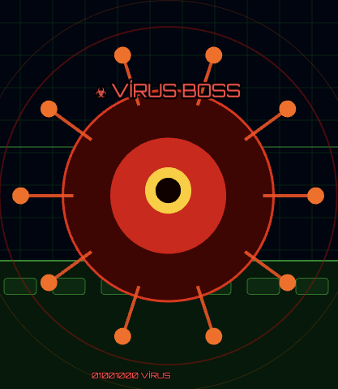

  Fonte - Elaborado pelos autores (2026) 

## 3.5. Gameflow (Diagrama de cenas) 

O diagrama de cenas de um jogo é uma representação visual da estrutura e do fluxo entre todas as telas e estados do sistema, como menu principal, tutorial, fases, pausas, telas de vitória ou derrota e créditos. Ele demonstra como o jogador transita de uma cena para outra por meio de ações (cliques, escolhas, eventos do jogo ou condições de vitória/derrota), funcionando como um mapa lógico da experiência. Nele também é encontrada a estrutura de código necessária para a contrução de todos os elementos visíveis e invisíveis ao jogador, servindo de peça-chave para que outros desenvolvedores avaliaem o produto entregado ou até mesmo refatorem-o dependendo de múltiplos requisitos ou finalidades.

  
  

  Fonte - Elaborado pelos autores (2026) 

## 3.6. Regras do Jogo 

Essa parte da documentação está destinada às condições de jogabilidade e vitória do jogo. Nela, estão descritas ações e respostas que o jogador deve realizar para a progressão do jogo.

### 3.6.1. Regras Gerais

As regras gerais são aquelas contempladasem todo o jogo, independente da fase ou missão que o jogador possa estar fazendo. São elas:

1. O jogador precisa interagir com os elementos da fase, sejam eles personagens, lugares com funções interativas ou minigames, a fim de progredir no jogo.

2. As cenas do jogo seguem o padrão de botões que podem ser acessados na seção "Tutorial" localizada no menu principal.

3. O jogo apresenta uma progressão linear, ou seja, todas as missões presentes no jogo são principais e, progressivamente, vão subindo para os novos andares à medida que o jogador avança.

4. Todos os diálogos são necessários de serem concluídos para o progresso nas missões do jogo.

### 3.6.2. Regras dos Minigames

A seguir, são descritas as regras de forma mais detalhada dos minigames presentes no jogo.

#### 3.6.2.1. Minigame Primeiro Andar (Fundamentos básicos da Inteligência Artificial)

1. O jogador precisa analisar os cards dispostos no centro da tela e arrastá-los até suas respectivas caixas (“Humano é mais eficiente” ou “IA é mais eficiente”).

2. Ao apertar em "salvar", os cards mudarão de cor, vermelho para errado e verde para certo; se houver qualquer card vermelho, o jogador deve arrastá-lo para sua caixa a fim de concluir o minigame.

3. Com todos os cards no lugar certo, o jogador poderá prosseguir para a próxima fase, encerrando o minigame.

#### 3.6.2.2. Minigame Segundo Andar (Machine Learning)

1. O jogador precisa analisar os cards dispostos no centro da tela e arrastá-los até suas respectivas caixas (“Conceitos relacionados a vírus” ou “Conceitos não relacionados a vírus”).

2. Ao apertar em "salvar", os cards mudarão de cor, vermelho para errado e verde para certo; se houver qualquer card vermelho, o jogador deve arrastá-lo para sua caixa a fim de concluir o minigame.

3. Com todos os cards no lugar certo, o jogador poderá prosseguir para a segunda parte do minigame, a cena de "ataque" ao vírus.

4. No momento final do minigame, o jogador deve perseguir o vírus,o qual se movimenta ao longo da tela, e destruí-lo com o comando do teclado (tecla “E”). O minigame encerra-se com a eliminação do vírus e o jogador pode prosseguir para a próxima fase.

### 3.6.2.3. Minigame Terceiro Andar (Agentes de IA e Deep learning)

1. O jogador deve realizar a conexão entre cards de conceitos e sua respectiva explicação dispostas na tela, a conexão dá-se por meio da seleção - clique - do “card-conceito” ao lado esquerdo e o posterior clique do “card-explicação” ao lado direito da tela.

2. Caso o jogador realize três conexões incorretas entre os conceitos e as definições, o minigame é reiniciado automaticamente. 

3. Ao estabelecer todas as conexões corretamente, o jogador conclui o desafio e o minigame é encerrado, permitindo o avanço para a próxima etapa.

### 3.6.2.4. Minigame Quarto Andar (Ética aplicada ao uso de IAs)

1. O jogador deve discernir se a conduta apresentada por outros funcionários é ética ou antiética: para casos de uso antiético, o jogador deve clicar no botão “mandar p/ RH”; para casos de uso ético, deve clicar no botão “Dar bônus”. 

2. Caso o jogador cometa dois erros de avaliação, o minigame é reiniciado.

3. Ao finalizar a análise dos relatórios sem atingir o limite de erros, o jogador conclui o minigame e pode seguir para o encerramento do jogo.

### 3.6.3. Regras de Vitória no Jogo

1. Concluir os minigames de drag and drop.
2. Concluir o minigame de conexão de conceitos
3. Concluir o minigame de análise de relatórios
4. Derrotar o vírus.
5. Completar todos os diálogos, desde conversas com NPCs a cutscenes com IAs.

### 3.6.4. Regras de Derrota no Jogo

 As regras de derrota do Thinkers Journey estão associadas às condições de derrota dos minigames, nas quais o jogador reinicia o desafio da fases - no caso, no terceiro e quarto andares. Pensando-se na proposta pedagógica, integrar regras de derrotas mais severas poderia tornar a gameplay mais frustrante, perdendo o caráter engajante que o jogo pretende entregar.

## 3.7. Mecânicas do jogo 

Primárias:

Movimentação- (esquerda, pulo, direita, AWD, <^>)
No jogo, a personagem é capaz de movimentar-se em três direções, para a esquerda, para a direita e para cima(pulo), com o intuito de promover a exploração dos cenários por parte do jogador.

Interações jogador- elementos(tecla E)
A interação do jogador com o mundo, além da imersão com o cenário, é reforçada pelo uso da tecla "E", onde o jogador será capaz de acessar desafios e diálogos pressionando tal tecla.

Secundárias:

Minigames- (Drag and drop)
Os minigames 1 e 2 estão estruturados no estilo drag and drop, onde o jogador, utilizando dos conhecimentos adquiridos no IBM Skills Build e no Thinkers Journey, arrasta cards que contém informações para uma das áreas designadas. Os minigames foram pensados para desafiar o jogador e provar seu aprendizado no decorrer do jogo.

Destruição do malware- (Vírus)
No segundo minigame desenvolvido, a personagem precisa destruir o vírus que infectou os servidores da empresa, após a fase do drag and drop, a personagem é vista dentro dos servidores e, de forma simbólica, ataca o malware, diminuindo a sua barra de vida até atingir zero e o sistema voltar a funcionar.

Minigame- (Match the wires)
O minigame 3 está estruturado no estilo match the wires, em que o jogador deve ligar os cards de uma coluna com alguns conceitos com os cards de outra coluna com a definição correspondente.

Minigame- Decisões
O minigame 4 possui a mecânica de decisões, em que o jogador receberá um relatório de um funcionário e terá que decidir corretamente entre 2 botões: Dar um bônus ou mandar para o RH.

## 3.8. Modelagem Matemática — Movimentação Bidimensional do Vírus Boss

### 3.8.1. Elemento Gráfico e Contexto

O elemento animado é o **vírus boss** da cena `MinigameBossScene`, representado por um container gráfico (`bossGfxCont`) que percorre trajetórias em arco pela tela durante o combate. A animação substitui a movimentação linear anterior (que usava apenas velocidade média no eixo X) por uma movimentação bidimensional cinemática real, implementada sem nenhuma função de animação da biblioteca Phaser. 

A animação do movimento do vírus tem duração de 4 segundos.

A função responsável é `animarBoss`, localizada na classe `MinigameBossScene` do arquivo `game.js`, a partir da linha onde a classe `MinigameBossScene` é declarada (buscar pela string `animarBoss` no arquivo). O consumo frame a frame ocorre no método `update` da mesma classe.

---

### 3.8.2. Parâmetros de Entrada da Função

A função `animarBoss(xi, yi, xf, yf, T, elem)` recebe exatamente os parâmetros exigidos:

| Parâmetro | Tipo | Descrição |
	
| `xi` | número (px) | Posição inicial no eixo X |
| `yi` | número (px) | Posição inicial no eixo Y |
| `xf` | número (px) | Posição final no eixo X |
| `yf` | número (px) | Posição final no eixo Y |
| `T` | número (s) | Duração total da animação em segundos |
| `elem` | Phaser.Container | Referência ao elemento gráfico animado |

---

### 3.8.3. Modelo Cinemático

O movimento é bidimensional, com os dois eixos operando simultaneamente a cada frame:

- Eixo X → Movimento Uniforme (MU): velocidade constante ao longo de toda a trajetória.
- Eixo Y → Movimento Uniformemente Variado (MUV): velocidade inicial nula, aceleração constante que leva o elemento do ponto inicial ao ponto final em exatamente `T` segundos.

Cada trajetória completa do boss é composta por dois semi-arcos encadeados: subida (do nível do chão até o ápice) e descida (do ápice até o outro lado da tela, voltando ao nível do chão). Cada semi-arco chama `animarBoss` independentemente com seus próprios parâmetros de início, fim e duração.

---

### 3.8.4. Definições do Modelo

Seja:
- `(xᵢ, yᵢ)` — posição inicial do elemento
- `(xf, yf)` — posição final do elemento
- `T` — tempo total da animação (segundos)
- `t` — instante de tempo, onde `0 ≤ t ≤ T`
- `Δx = xf − xᵢ` — deslocamento horizontal total
- `Δy = yf − yᵢ` — deslocamento vertical total

--- 
### 3.8.4. Eixo X  Movimento Uniforme (MU)

No eixo X, o movimento ocorre com velocidade constante.

 Função da velocidade no eixo X

  
  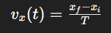

	

 Função da posição no eixo X

  
  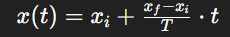

### 3.8.6. Eixo Y — Movimento Uniformemente Variado (MUV)

No eixo Y, o movimento parte do repouso (velocidade inicial zero) com aceleração constante.

 Função da aceleração no eixo Y

  
  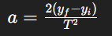

​

 Função da velocidade no eixo Y	​

  
  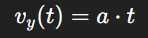

 Função da posição no eixo Y

  
  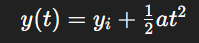
  

### 3.8.7. Implementação Completa no Código  

  
  
  

  
  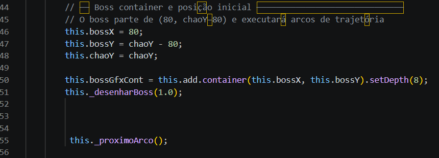
  

  
  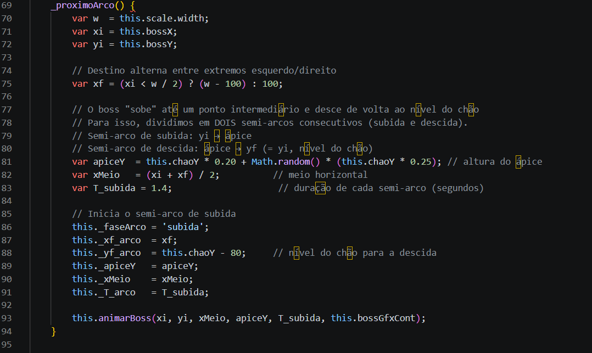
  

  
  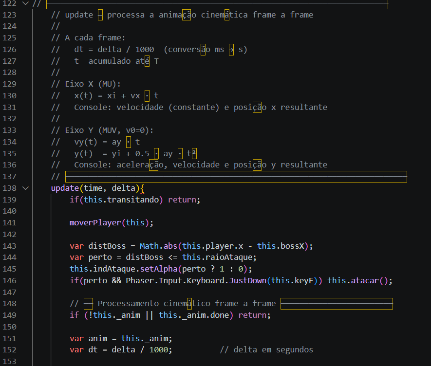
  

  
  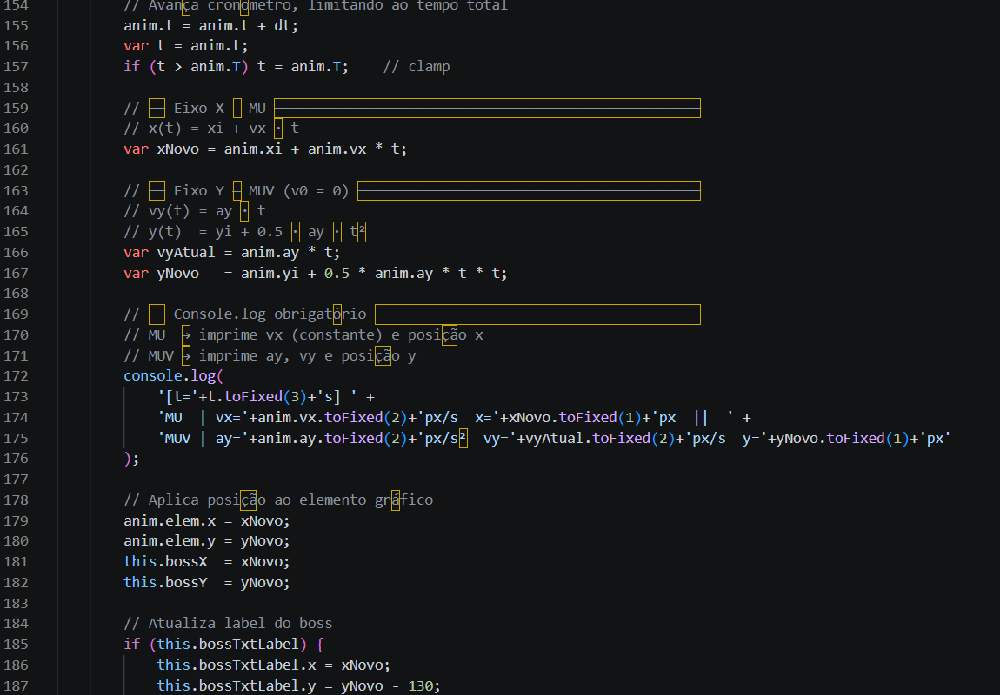
  

  
  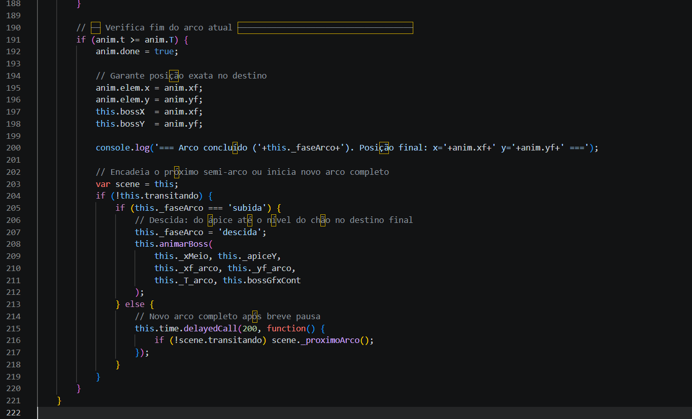
  

#### Legenda:

Linha 1 a 26: Aplicação Mátematica

Linha 44 a 55: Primeiro Arco

Linha 69 a 94: Secundário Arco

Linha 122 a 222: Bloco maior de código onde está todos os outros juntos

# 4. Desenvolvimento do Jogo

## 4.1. Desenvolvimento preliminar do jogo 

Nessa primeira etapa, o jogo apresenta uma cutscene inicial na qual a personagem dirige-se à empresa onde ela irá trabalhar. Após esse cenário, a personagem entra no hall e consegue ser movida pelas teclas AD, destinando-se até uma recepcionista, que fornecerá informações da narrativa e instruções para a progressão do usuário.

  Sprites | O que é |  | Contexto
--- | --- | --- | ---
1|Tela de abertura|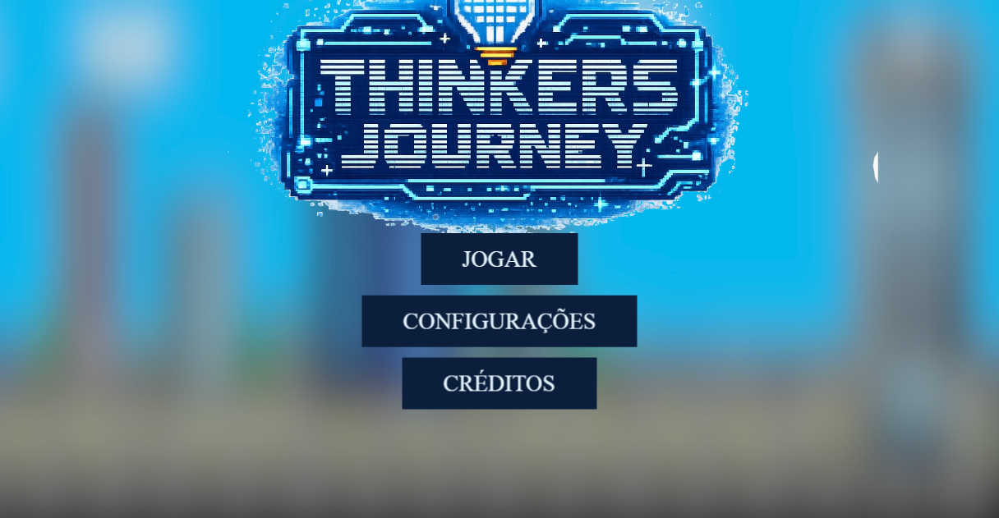|Primeira tela da interface do jogo
2|Primeiros sprites da personagem|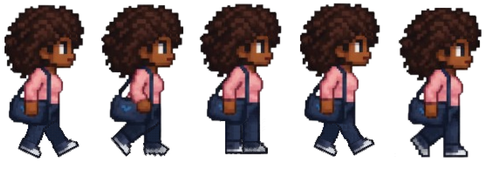|Primeiras ideias da confecção da personagem
3|Cidade|| Tela da cidade, que a personagem percorre até chegar à empresa (não jogável)
4|Hall inicial|| Primeiro cenário jogável pela personagem
5|recepcionista|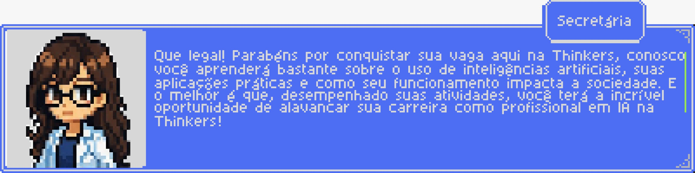| NPC que fornece as primeiras instruções do jogo.

Fonte: Imagens feitas pelo grupo, 2026.

## 4.2. Desenvolvimento básico do jogo

### 4.2.1. Visão Geral

Nesta etapa, foram desenvolvidos novas dinâmicas que tornam o jogo mais interativo e, pela primeira vez, educativo, implementando uma npc no 1° andar para ensinar os primeiros conceitos de IA. Além disso, para complementar a experiência do usuário, foi adicionada uma tela de tutorial e de configurações, onde é possível ajustar a trilha sonora do jogo, bem como novos personagens interagíveis que tornam o jogo ainda mais imersivo.

### 4.2.2. Elementos Implementadas
- **Mudança no menu**: Foi adicionada uma paleta de cores mais clara para contratar com o jogo.
- **Mudança na caixa de diálogo**: A caixa de diálogo recebeu maior espaçamento entre as palavras e mudança na paleta de cor para ficar mais visível.
- **Mudança na logo**: A logo foi alterada para a logo antiga(pixelada), para combinar mais com o jogo.
- **Pulo**: Foi implementada para adicionar mais mobilidade ao jogador.
- **Minigame do primeiro andar**: A mecânica de Drag and Drop foi integrada para oferecer entretenimento e aprendizado ao jogador.
- **Segundo andar**: Novo espaço integrado ao jogo.
- **Novos personagens**: Foi implementado novos NPCs como o supervisor do segundo andar e o vírus.
- **Minigame do segundo andar**: Mecânica semelhante a do primeiro andar, porém com tema diferente.
- **Espaço dentro do sistema**: Cena que serve como proposta narrativa, que visa uma representação figurativa da protagonista derrotando o vírus.
- **Atacar o vírus**: Foi implementado a mecânica de causar dano ao vírus ao se aproximar dele.
- **Andares bloqueados**: O jogador deve completar os minigames para desbloquear os andares.

#### 4.2.3.1. Tela de tutorial

Tela de tutorial implementada para mostrar as teclas disponíveis na movimentação e interação do jogador com os elementos do jogo

   
  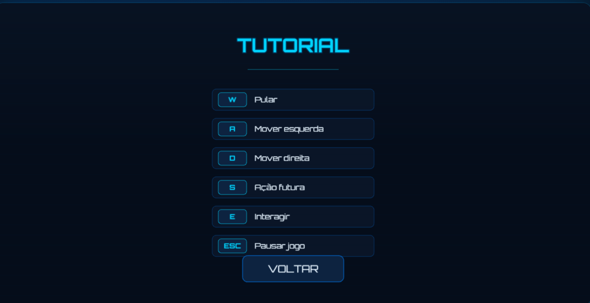

  Fonte - Elaborado pelos autores (2026) 

#### 4.2.3.2. Cena do chefe

Cena de interação com o personagem que comanda a empresa e recepciona o jogador na sua jornada

   
  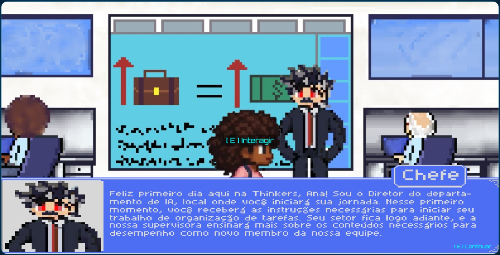

  Fonte - Elaborado pelos autores (2026) 

#### 4.2.3.3. Cena da supervisora

Cena de interação com a personagem que ensinará as primeiras noções de inteligência artificial para o jogador na sua jornada

   
  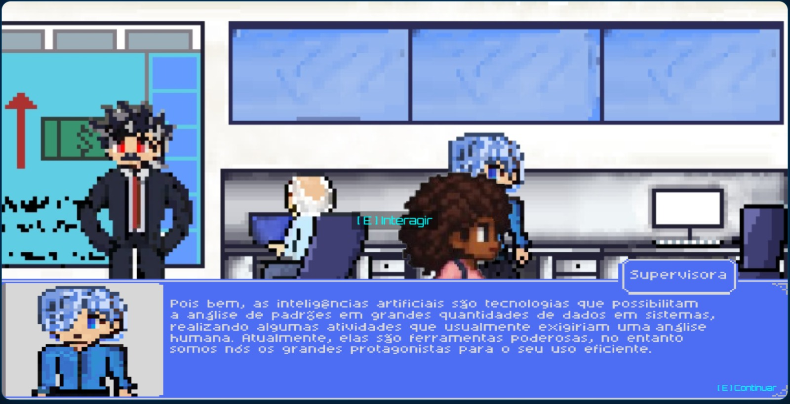

  Fonte - Elaborado pelos autores (2026) 

## 4.3 Desenvolvimento intermediário do jogo

### 4.3.1. Visão Geral:
Ao final da Sprint 3, o jogo Thinkers Journey apresenta uma progressão linear consolidada, contemplando menu principal, cena animada introdutória da personagem entrando no prédio da Thinkers, cenas jogáveis dos andares térreo, primeiro e segundo, além dos minigames integrados a essas fases. Paralelamente, recursos visuais adicionais já foram produzidos pela equipe, tais como o terceiro andar e o crachá da personagem , ainda que não tenham sido introduzidos no jogo nesta etapa.

### 4.3.2. Dificuldades:
Nessa sprint o grupo passou por uma série de dificuldades devido a falta de organização em vários setores, como nos cards do Kanban, na divisão de tarefas e nas grande quantidade de faltas, o que levou a má distribução de tarefas.
Além disso, houve uma série de dificuldades na parte de produção do jogo:

No setor de programação houve um sério problema, pois todas as alterações do código foram commitadas em apenas uma vez, perto do fim da sprint. Devido a isso, o grupo enfrenta dificuldades para consertar alguns erros e consertar o códigos. Em consequência disso, o deploy não está funcionando.

No setor de design houve problema devido ao tempo gasto para remodelar o jogo. No início da sprint, o grupo teve como objetivo transformar o jogo de 2D para 2.5D. A ideia não deu certo, devido à dificulade de mudar todas configurações para esse estilo. Como resultado, o design 2D foi mantido e muito tempo foi perdido.

No setor da documentação houve um grande atraso, devido à dificuldade dos outros setores, os encarregados da documentação tiveram de focar em design e programação. Como consequência a documentação do GDD foi atrasada.

### 4.3.3. implementações:
Nesta sprint foram adicionadas diversas implementações no jogo:

#### 4.3.3.1. Cenários adicionados
Foram adicionados 3 cenários no total. Abaixo estão respectivamente o segundo andar sob invasão do vírus, o segundo andar com a crise solucionada e o espaço dentro do sistema, onde abriga o vírus.

   
  

  Fonte - Elaborado pelos autores (2026) 

   
  

  Fonte - Elaborado pelos autores (2026) 

   
  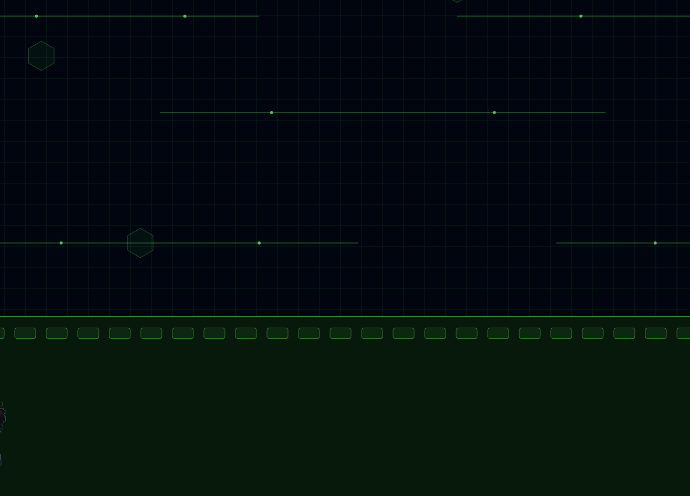

  Fonte - Elaborado pelos autores (2026) 

#### 4.3.3.2. Personagens adicionados
Foram adicionados 2 personagens do segundo andar: respectivamente o supervisor do segundo andar e o vírus.

   
  

  Fonte - Elaborado pelos autores (2026) 

   
  
  

  Fonte - Elaborado pelos autores (2026) 

#### 4.3.3.3. Mecânicas novas
Foram adicionadas 2 mecânicas novas, incluindo o pulo, através da tecla w ou da seta pra cima e o botão E para interagir com os NPCs, computador, cenário e etc.

#### 4.3.3.4 Minigames
Foram criados 2 minigames com mecânicas semelhantes nessa sprint. Ambos minigames possuem a mecânica do Drag and Drop, nesse modelo, haverão vários cards no centro com palavras escritas e 2 colunas com temas opostos, o objetivo do jogador é arrastar a palavra para a coluna que ela se encaixa.

##### 4.3.3.4.1. Minigame do primeiro andar
No minigame do primeiro andar o jogador deverá separar diversas atividades entre o que o humano faz melhor e o que a IA faz melhor.

   
  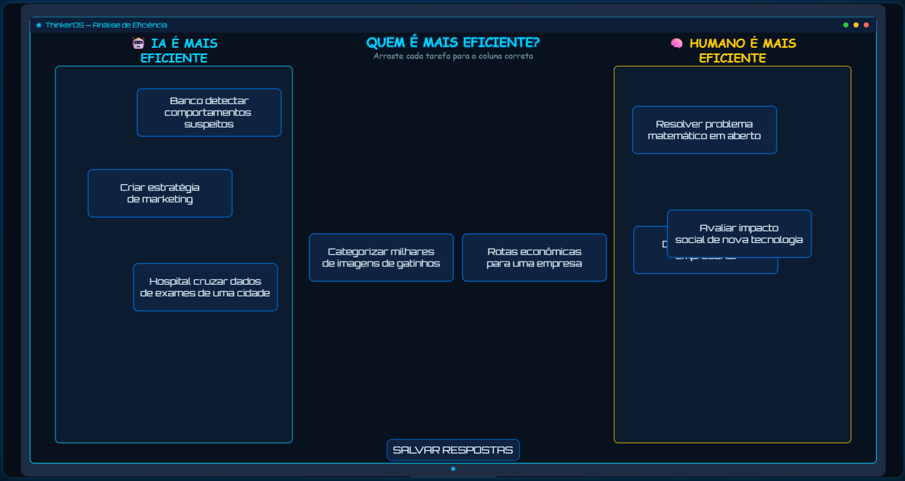

  Fonte - Elaborado pelos autores (2026) 

##### 4.3.3.4.2. Minigame do segundo andar
O minigame do segundo andar se passa em um contexto de crise e o jogador tem como objetivo alimentar a IA com dados que serão úteis para caçar o vírus. Portanto neste minigame o jogador deverá filtrar os dados e separa eles entre dados úteis e os que não serão.

   
  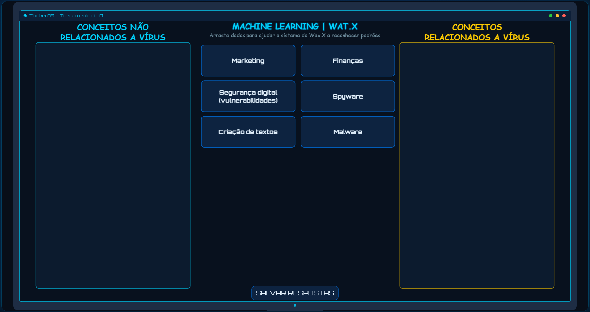

  Fonte - Elaborado pelos autores (2026) 

 ## 4.4. Desenvolvimento final do MVP

 ### 4.4.1. Visão Geral da Etapa Final

A etapa final de desenvolvimento da Thinkers Journey tem como  foco juntar todos os sistemas, mecânicas e elementos narrativos construídos nas sprints anteriores, para transformar o projeto em uma experiência completa e alinhada aos objetivos educacionais propostos.
Diferente das fases iniciais, que estavam mais voltadas para a estrutura do jogo, esse momento é dedicado ao refinamento, podendo melhorar a jogabilidade, garantir a estabilidade técnica e fortalecer a conexão entre aprendizado e entretenimento.
Ao final dessa etapa, o resultado é um produto totalmente jogável, em que o usuário percorre uma jornada completa de evolução profissional enquanto desenvolve conhecimentos em inteligência artificial.

### 4.4.2. Dificuldades, Ajustes de Escopo e Decisões Estratégicas

Durante a etapa final de desenvolvimento, a equipe se deparou principalmente com dois desafios: o tempo limitado e a complexidade cada vez maior do projeto.
No início, o jogo foi pensado com seis andares, cada um representando uma fase da progressão de carreira em inteligência artificial. Porém, ao avaliar o que realmente seria possível entregar com qualidade dentro do prazo, a equipe decidiu reduzir esse escopo para quatro andares totalmente funcionais.
Essa escolha foi estratégica. A prioridade passou a ser entregar um produto completo, jogável do início ao fim, garantindo também tempo suficiente para desenvolver, testar e ajustar os minigames, além de manter a qualidade das mecânicas.
Essa decisão segue a lógica do desenvolvimento ágil: mais importante do que ter muitas funcionalidades é entregar valor real e uma experiência consistente para o usuário.

### 4.4.3. Implementações e Consolidação da Progressão

Na Sprint 4, o foco foi consolidar o jogo como um sistema integrado, garantindo que todas as mecânicas, cenas e elementos narrativos funcionassem de forma alinhada. Essa etapa foi essencial para fechar a experiência do jogador, conectando tudo o que já havia sido desenvolvido com as novas implementações.
Nesse momento, a progressão do jogo foi ampliada com a criação do 3º e 4º andar, permitindo que a jornada da personagem Ana dentro da empresa continuasse de forma mais completa. Ao mesmo tempo, o sistema de navegação entre os andares foi totalmente integrado, garantindo transições mais fluidas entre os diferentes ambientes.
A evolução da personagem também foi aprofundada nesses novos níveis, enquanto o fluxo entre diálogos, momentos de gameplay e minigames passou por ajustes para ficar mais natural e coerente.
Com isso, o gameflow final passou a oferecer uma jornada contínua: o jogador começa no térreo, recebe as instruções iniciais e avança pelos andares resolvendo desafios. Conforme progride, é promovido e passa a enfrentar situações cada vez mais complexas. O resultado é uma experiência linear, intuitiva e alinhada com a proposta de aprendizado gradual.

### 4.4.4. Cenários Adicionados e Estrutura Final do Jogo

Foram adicionados dois novos cenários correspondentes ao 3º e 4º andar da empresa Thinkers. Esses cenários representam a evolução da personagem dentro do ambiente corporativo, refletindo níveis mais altos de responsabilidade e complexidade nas tarefas.

   
  

  Fonte - Elaborado pelos autores (2026) 

   
  

  Fonte - Elaborado pelos autores (2026) 

### 4.4.5. Personagens Adicionados

Com a expansão do jogo para novos andares, houve a necessidade de inclusão de personagens que acompanham a progressão narrativa.

  Figura 01

  

  Fonte - Elaborado pela equipe (2026) 

  Figura 02

  

  Fonte - Elaborado pela equipe (2026) 

### 4.4.6. Minigame do terceiro andar

No terceiro andar, o jogador precisa fazer conexões entre conceitos de IA e suas definições ou aplicações. A ideia é apenas ligar corretamente os elementos que fazem sentido entre si, como se estivesse organizando informações e entendendo relações entre dados.
Esse minigame exige muita atenção e raciocínio lógico, já que não é só reconhecer algo, mas realmente entender como os conceitos se conectam. Ele representa um momento em que a personagem começa a assumir um papel mais analítico dentro da empresa, mostrando uma evolução clara na sua jornada e no nível de complexidade do jogo.

   
  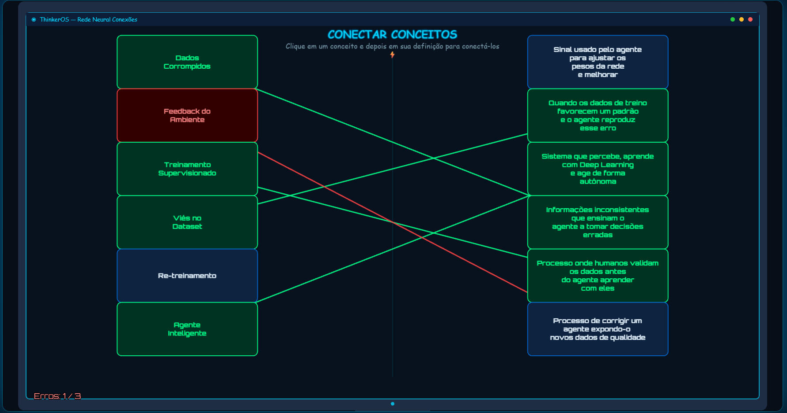

  Fonte - Elaborado pelos autores (2026) 

### 4.4.6.1. Minigame do quarto andar 

No quarto e último andar, o foco muda um pouco, já que o jogador passa a lidar com decisões mais humanas do que técnicas. Nesse momento, ele interage com um comitê de ética e analisa situações fictícias que envolvem o uso de inteligência artificial dentro da empresa.
O minigame consiste em ler o que cada personagem do jogo fez e decidir se aquela atitude foi correta ou se deveria ser encaminhada para o RH. Não existe apenas certo ou errado lógico, o que faz o jogador refletir mais sobre as consequências das decisões.

   
  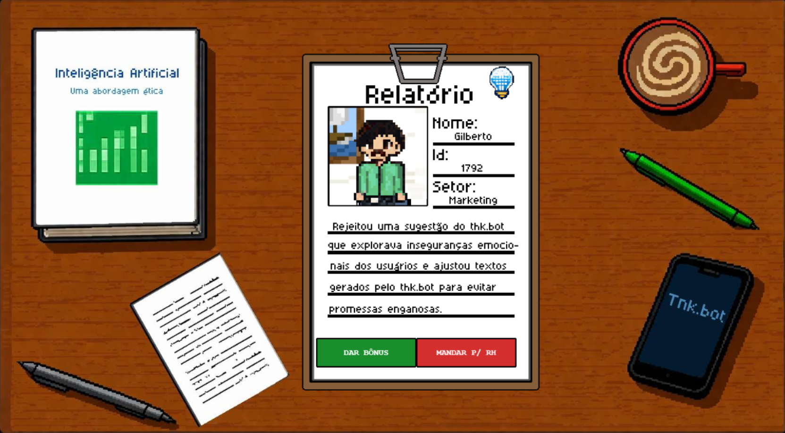

  Fonte - Elaborado pelos autores (2026) 

## 4.5. Revisão final do MVP

Na etapa de fechamento e polimento do MVP, a equipe focou na implementação de mecânicas de recompensa e no aprimoramento da curva narrativa. O objetivo destas últimas adições foi solidificar o ciclo de jogo (game loop) desta versão, garantindo que o jogador sinta que seu esforço é reconhecido e que a história tem continuidade.

As principais implementações desta fase final foram:

### 4.5.1 Feedback visual de progressão (Sistema de crachás):

Para resolver a necessidade de um marcador claro de avanço no jogo, implementamos um sistema visual baseado no crachá da personagem principal. Conforme o jogador conclui objetivos, o crachá é atualizado refletindo o novo cargo conquistado. Esta decisão de design de interface (UI) funciona como um sistema de "Level Up" disfarçado na narrativa, entregando um feedback contínuo e recompensador que aumenta a sensação de ascensão profissional e engajamento do usuário.

**Crachás implementados:**
| | | | | |       
--- | --- | --- | --- | ---
 |  |  |  | 

   Fonte - Elaborado pelos autores (2026)
  

### 4.5.2 Encerramento da experiência e hook narrativo (Cutscene final):

Para criar uma transição suave entre o fim do conteúdo do MVP e um desenvolvimento futuro do jogo, implementamos uma cutscene de conclusão com foco na passagem de tempo. Após o jogador superar todas as fases, o jogo indica o fim do expediente em um cenário noturno. A cutscene então realiza uma transição temporal, mostrando o dia amanhecendo, o que culmina na imagem da personagem já na sala do seu chefe no dia seguinte. Essa construção cumpre dois papéis técnicos: primeiro, atua como o encerramento da experiência atual (fechando o ciclo daquele dia de trabalho de forma visualmente polida); segundo, a reunião com o chefe funciona como um gancho (cliffhanger), indicando ao jogador que a jornada profissional continuará e preparando o terreno para a introdução de novas fases e desafios em possíveis versões do projeto no futuro.

   Cidade durante a noite 

  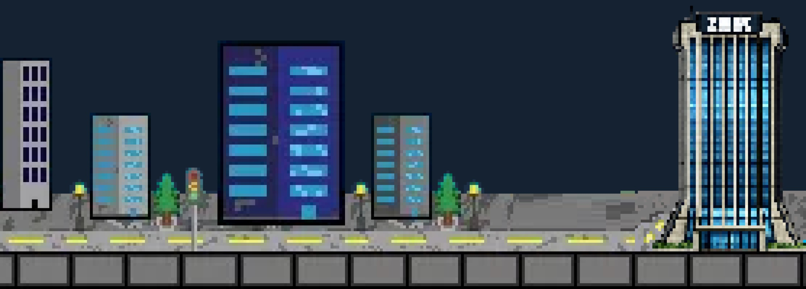

  Fonte - Elaborado pelos autores (2026) 

   Cidade durante o dia 

  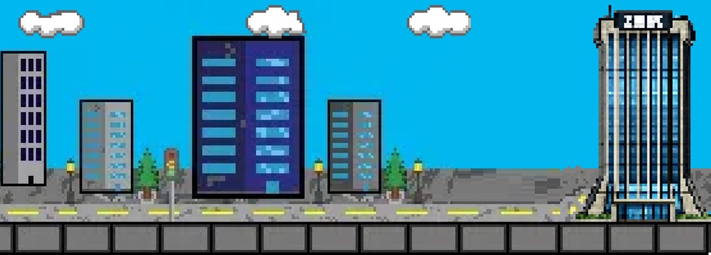

  Fonte - Elaborado pelos autores (2026) 

   Cutscene final do MVP 

  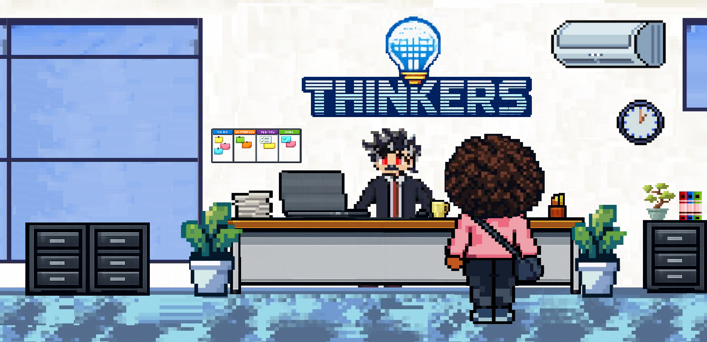

  Fonte - Elaborado pelos autores (2026) 

# 5. Testes

## 5.1. Casos de Teste

Casos de teste é uma documentação detalhada de um cenário específico para garantir a qualidade do software. Ele deve conter obrigatoriamente campos como ID, Descrição, Passos, Resultado Esperado e Status, ou ainda, no tabelamento que estabelecemos, Pré-Condição, Condição e Pós-Condição, pois essa padronização permite que qualquer desenvolvedor ou analista valide os requisitos do consumidor de forma objetiva e repetível. Sem essa estrutura, o teste torna-se informal e propenso a falhas, dificultando a identificação de bugs e a comprovação de que o sistema realmente entrega o valor prometido no Canvas de Proposta de Valor. 

| ID | Cena                      | Caso de Teste                                                                                      | Resultado Esperado                                                                                   |
|----|---------------------------|-----------------------------------------------------------------------------------------------------|-------------------------------------------------------------------------------------------------------|
| 01 | `MenuScene`                 | Verificar a responsividade dos botões                                            | Mudar a cena dependendo do botão clicado                                       |
| 02 | `ConfigScene`              | Verificar se ao clicar no botão "CONFIGURAÇÕES" a cena muda                                                  | Mostrar a configuração de áudio                                |
| 03 | `TutorialScene`       | Verificar se ao clicar no botão "TUTORIAL" a cena muda                                                         | Mostrar o que cada tecla faz dentro do jogo                                      |
| 04 | `CreditsScene`       | Verificar se ao clicar no botão "CRÉDITOS" a cena muda                                                                            | Mostrar o que cada membro do grupo fez no projeto                                              |
| 05 | `Hall`             | Verificar a movimentação do personagem                                                                    | Teclas A e D movimentam o personagem, respectivamente para esquerda e direita                                                       |
| 06 | `recepcionista`               | Verificar funcionalidade da interação com a recepcionista, por meio da tecla 'E', além de examinar se o personagem permanece parado após iniciar a conversa                                      |   Ao personagem se aproximar da recepcionista, a zona interativa ficará visível e ao clicá-lo será possível conversar com a recepcionista além de impedir a movimentação durante a interação            |
| 07 | `Entrada`               | Verificar se a interação do jogador com a zona interativa do elevador o levará para a cena ElevatorScene                            | Ao clicar 'E' perto do elevador, o jogador será deslocado para dentro do elevador               |
| 08 | `Elevador`                 | Verificar se a cena dentro do elevador apresenta os botões, que ao serem clicados, deslocarão o jogador entre andares                                                              | O jogador poderá escolher o andar desejado      |
| 09 | `Chefe`                 | Verificar a interação do jogador com o chefe examinar.                          | Ao chegar no primeiro andar, o jogador poderá iniciar o diálogo com o chefe                                          
| 10 | `Supervisora`                 | Verificar a interação do jogador com a supervisora               | Após conversar com o chefe, o jogador poderá interagir com sua supervisora                   |
| 11 | `Cards do minigame`                 | Verificar se os cards estão se movendo junto do ponteiro do mouse ao serem arrastados pelo player              | Os cards devem se mover juntamente do ponteiro     |
| 12 | `Tela de vitória`                 | Verificar se o jogo mostra a tela de vitória  | A tela de vitória aparece caso o player acertar todos os cards     |
| 13 | `Cards errados`                 | Verificar se o jogo apresenta quais cards estão errados e checar se ele reinicia o minigame | Os cards errados estarão vermelhos e o minigame é reiniciado, até o jogador acertar todos os cards  |
| 14 | `Cards faltando`                 | Verificar se o jogo avisa o jogador de que há cards que não foram arrastados para um das caixas  | O jogo avisará o jogador que há cards que ainda não foram arrastados    |
| 15 | `Primeira promoção`                 | Verificar se o jogo libera o segundo diálogo com o chefe, responsável pela promoção  | Após completar o primeiro minigame, o jogador poderá retornar ao chefe e ele o promoverá e liberará o segundo andar     |
| 16 | `Atualização do elevador`                 | Verificar se o segundo andar é liberado  | O jogador retorna ao elevador e o segundo andar estará disponível    |
| 17 | `Supervisor 2`                 | Verificar se no momento em que o jogador chegar no segundo andar, ele permanecerá imóvel e chegará o Supervisor 2, que irá dar um contexto da crise e convidará o jogador a ajudar| Ao chegar no segundo andar o jogador entrará em um diálogo com o Supervisor 2 que o levará ao segundo minigame    |
| 18 | `Minigame 2`                 | Verificar se o minigame 2 se comporta de forma semelhante ao minigame 1 | O minigame 2 apresenta mecânica semelhante ao minigame 1 de Drag and Drop  |
| 19 | `Coerência dos cards do minigame 2`                 | Verificar se ao arrastar o ponteiro em cima dos cards sem pressionar, um texto explicando o significado da palavra surgirá  | Um texto explicando a palavra do card manifestará, caso o jogador passar o ponteiro por cima dos cards  |
| 20 | `Tela do vírus`                 | Verificar se o jogo muda de tela para a tela do vírus ao completar o minigame 2  | Após completar o minigame 2, o jogador será deslocado para o local onde o vírus se encontra  |
| 21 | `Atacar o vírus`                 | Verificar se o jogador tira um vida do vírus ao clicar E  | Ao se aproximar do vírus, a zona interativa E estará disponível e o jogador poderá atacar o vírus  |
| 22 | `Segunda promoção`   | Verificar se o terceiro andar está disponível, após conversar com o chefe  | Após derrotar o vírus, o jogador poderá conversar com o chefe e será promovido para o terceiro andar  |
| 23 | `Segunda promoção`   | Verificar se o secretário 2 inicia conversa automaticamente, após o jogador derrotar o vírus.  | Após derrotar o vírus, o jogador entrará automaticamente em um diálogo com o supervisor 2, que o promoverá para o terceiro andar.  |
| 24 | `Atualização do elevador 2`   | Verificar se o botão do terceiro andar está disponível  | Ao entrar no elevador, o botão do terceiro andar deve ser liberado. |
| 25 | `Assistente`                 | Verificar se o assistente do terceiro andar inicia conversa, caso o jogador se aproximar.  | Ao se aproximar do assistente, o jogador automaticamente entrará em um diálogo com ele.  |
| 26 | `Minigame 3`                 | Verificar se o jogador consegue ligar os cards, identificando se a ligação está incorreta ou não.  | O jogador poderá ligar um card de cada coluna, caso acertar, a linha ficará verde, caso contrário a linha ficará vermelha e o jogador poderá tentar de novo. |
| 27 | `Tela de derrota do minigame 3`                 | Verificar se o jogo mostra a tela de derrota, caso o jogador errar 3 vezes. Além disso, essa tela deve apresentar um botão funcional para o jogador tentar novamente.  | Se o jogador errar 3 vezes, o jogo mostrará a tela de derrota que apresentará um botão para ele tentar novamente.  |
| 28 | `Terceira promoção`                 | Verificar se o asssistente inicia uma conversa com o jogador, liberando o quarto andar.  | Ao se aproximar do assistente, após completar o minigame 3, o assistente direcionará o jogador ao quarto andar.  |
| 29 | `Atualização do elevador 3`   | Verificar se o botão do quarto andar está disponível  | Ao entrar no elevador, o botão do quarto andar deve ser liberado. |
| 30 | `Coordenadora chefe`   | Verificar se a coordenadora chefe inicia um diálogo, caso o jogador se aproximar dela  | Ao jogador se aproximar da coordenadora chefe, ele poderá jogar o minigame 4 de ética. |
| 31 | `Minigame 4`   | Verificar se o minigame 4 apresenta 4 relatórios, um de cada vez, para serem separados entre "dar bônus" e "mandar p/ RH".  | Ao iniciar o minigame 4, o jogador deve separar corretamente 4 relatórios. |
| 32 | `Tela de derrota do minigame 4`   | Verificar se caso o jogador errar dois relatórios, o jogo mostrará a tela de derrota, apresentando um botão para continuar, que levará a outro diálogo com a coordenadora de chefe, que permitirá que o jogador tente novamente.  | Caso o jogador erre um relatório, uma tela de derrrota aparecerá, direcionando o jogador para conversar novamente com a coordenadora chefe, que permitirá ao jogador tentar novamente. |
| 33 | `Tela de vitória do minigame 4`   | Verificar se caso o jogador errar no máximo um relatório, o jogo mostrará a tela de vitória, apresentando um botão para continuar, que levará ao diálogo final com coordenadora de chefe, que inicia a cutscene de fim de jogo.  | Caso o jogador acerte três ou todos os relatórios, uma tela de vitória aparecerá, direcionando o jogador para conversar com a coordenadora chefe, que se despedirá do jogador já que o expediente acabou. |
| 34 | `Cutscene final do jogo`   | Verificar se ao falar com a coordenadora após o fim do minigame, o jogo inicia a cutscene final, composta de dois quadros da cidade com o prédio da empresa e uma no escritório do chefe.  | Ao término do diálogo final da coordenadora, o jogador é redirecionado para uma cutscene que mostra a mudança de dia e um diálogo com o chefe da empresa. |
| 35 | `Menu principal após cutscene`   | Verificar se o jogador é levado até o menu principal do jogo após o fim da última cutscene.  | A cena do menu principal é iniciada logo depois do fim da cutscene. |

### 5.2.1 Registros de testes

#### Testes realizados no Inteli, no dia 01/04/2026
Os participantes foram convidados a jogar o Thinkers Journey em um notebbok com sistema operacional Windows. A equipe de desenvolvedores organizou-se em duplas; um dos membros da dupla era o facilitador (orientava o participante e o fazia perguntas ao longo da gameplay) e o outro era o observador (registrava os dados fornecidos pelo participante). Assim, ao final dos playtests, as seguintes informações coletadas foram organizadas em tabela com as respectivas informações dos jogadores:

Tabela - Registro de testes

| Nome              | Faixa etária | Experiência com games         | Conseguiu iniciar o jogo? | Entendeu regras/mecânicas                              | Conseguiu progredir no jogo?        | Apresentou dificuldades?                              | Nota | Pontos positivos                                       | Sugestões de melhoria                                                    |
|-------------------|---------------|-------------------------------|----------------|---------------------------------------------------------|-------------------|-------------------------------------------|------|--------------------------------------------------------|-------------------------------------------------------------------------|
| Paulo      | 17 - 23       | Não, pouca experiência          | Sim            | Entendeu bem as regras e as mecânicas do jogo             | Sim | Não                                         | 8.0  | Apresenta proposta diferentes, como a ideia de andar por uma empresa; a música foi interessante.                     | O texto deve entrar mais devagar na tela; apresentar explicação prévia do jogo do vírus (um tutorial); explicar um pouco mais sobre IA.                                         |
| Gabriela   | 17 - 23       | Sim, joga todos os dias       | Sim            | Entendeu bem as regras, mas não as mecânicas                                                    | Sim               |      Apresentou dificuldade no minigame do 1° e 3° andares             | 9.0 | Design dos andares e das cutscenes                           |  Implementar um melhor marcador de progresso no jogo                      |
| Milena     | 17 - 23      | Sim, joga às vezes                           | Sim            | Entendeu a maior parte das regras e mecânicas                                                     | Sim               | Dificuldade para entender as mecânicas do minigame do vírus                  | 8.5  | Estética do dos andares e minigames interessantes                                        | Implementar uma tela de tutorial para o minigame do vírus                  |
| Joaquim     | 17 - 23       | Sim, joga casualmente                         | Sim            | Entendeu bem as regras e as mecânicas do jogo                                                   | Sim               |          Apresentou dificuldade nos minigames de "drag and drop", nos 1° e 2° andares.          | 8.0  | O conteúdo apresentado sobre IAs                                    | Melhorar a visibilidade das letras na caixa de texto e um fornecer um tutorial para o minigame do vírus                |
| Francisco      | 17 - 23       | Sim, joga com frequência            | Sim            | Entendeu bem as regras e mecânicas do jogo                                                   | Sim               |        Entender as mecânicas no minigame do vírus           | 8.5 | A ideia dos minigames                                       | Poderia implementar mais interações da personagem com NPCs no jogo                       |
| Tadashi       | 17 - 23       | Sim, joga com frequência      | Sim            | Entendeu bem as regras e mecânicas do jogo                                                    | Sim               |         Apresentou dificuldade para associar os conceitos no primeiro minigame          | 9.0  | As interações com os NPCs nos andares                           | O jogo poderia reduzir a quantidade de textos e ser mais objetivo nos diálogos                   |
| Ana | 17 - 23       | Sim, joga com frequência       | Sim            |      Entendeu bem as regras e mecânicas do jogo                | Sim               | Apresentou dificuldade em associar os cards no minigame do 3° andar                                         | 8.0 | Design dos andares da empresa                                    | Implementar uma tela de conclusão no jogo quando ele encerrar                                         |

### 5.2.2 Melhorias

Com base na coleta e análise dos dados provenientes das sessões de playtest com o público-alvo, foram identificadas oportunidades essenciais para o aprimoramento da experiência do usuário (UX) e o balanceamento geral do jogo. As diretrizes abaixo descrevem as implementações e refatorações que devem ser priorizadas para próximas iterações do desenvolvimento

#### 5.2.2.1  Interface de Usuário (UI) e Experiência do Usuário (UX)

**1. Legibilidade e Exibição de textos:** a visibilidade da fonte dentro das caixas de diálogo pode ser aprimorada (ajuste de contraste/tamanho). Além disso, a redução da velocidade de renderização das letras na tela ajudaria a garantir uma leitura mais confortável, acompanhando o ritmo natural do jogador. De um modo geral, essas melhorias corroboram uma transmissão mais efetiva da proposta pedagógica.

**2.Feedback Visual de Progresso:** pensando-se em fornecer ao jogador uma compreensão mais clara e imediata do seu avanço dentro da jornada do jogo, a implementação de um marcador de progresso mais evidente e intuitivo é um aprimoramento importante para futuros trabalhos . 

**3. Tutorial do Minigame do Vírus:** identificou-se uma alta demanda por clareza mecânica nesta etapa. Para resolver essa lacuna, pensa-se desenvolver uma tela prévia de tutorial especificamente para o "minigame do vírus", apresentando as regras e os controles antes que o jogador seja exposto ao desafio.

#### 5.2.2.2 Narrativa, Diálogos e Interação no Mundo (Level Design)

**1. Otimização de Diálogos:** nos testes, usuários notaram excesso de diálogo, portanto o roteiro pode passar por uma revisão visando a reduzir o volume de texto bruto; e, com efeito, a comunicação será mais objetiva e direta, priorizando a fluidez do gameplay sem perda de contexto narrativo.

**2. Expansão Temática (Inteligência Artificial):** um dos aprimoramentos identificados é detalhar mais os conceitos de IA dentro do universo do jogo. Assim a exposição de temas como “machine learning” ou “agentes de IA” pode ser diluída e melhor explicada ao jogador, integrando-os de forma mais orgânica à história.

**3. Interações com NPCs:** por fim, outro tópico de melhoria, para aumentar o engajamento e a imersão nas fases, é expandir o escopo de interações da personagem principal com os Non-Playable Characters (NPCs), tornando o mundo mais vivo e responsivo à exploração.

# 6. Conclusões e trabalhos futuros

## 6.1. Conclusão

O Thinkers Journey provou ser uma ferramenta eficaz para tornar o aprendizado de inteligência artificial mais envolvente e acessível para jovens universitários. Ao integrar uma narrativa de ascensão profissional com os conceitos do IBM SkillsBuild, o projeto criou uma experiência educativa funcional que conversa com as dores de engajamento do público-alvo e transmite os conceitos da plataforma da IBM de forma dinâmica e assertiva.

Apesar dos desafios, a entrega de um MVP completo e jogável foi executada, focando na qualidade da jornada e na narrativa transmitida ao usuário. Os dados coletados indicam que a proposta de explorar uma empresa fictícia e progredir entre andares através de desafios práticos (como Machine Learning e Ética em IA) possui potencial de se consolidar como uma solução educacional aplicada ao mercado.

## 6.2. Trabalhos Futuros: experiência do usuário

Com base no feedback direto dos usuários coletado durante os playtests e das discussões internas do grupo, as seguintes funcionalidades foram identificadas como trabalhos futuros pensados para a evolução da experiência do usuário (UX):

- **Acessibilidade:** Adicionar mecânismos que apresentem opções para melhorar a leitura de usuários com dificuldades visuais: como a opção de aumentar as letras do jogo ou apresentar opções de diferentes tipos de contraste das caixas de diálogo.
- **Ritmo de Leitura:** Implementar um sistema configurável de velocidade de renderização de texto, permitindo que o jogador ajuste o ritmo de exibição das letras conforme sua preferência de leitura.
- **Minimapa:** Desenvolver uma HUD que apresente a localização atual do jogador no ambiente que se situa e também o local onde ele deve ir, assim, tornando o jogo mais intuitivo.
- **Animação de promoção:** Para mostrar ao jogador que uma promoção no ambiente corporativo se trata de algo importante e emocional, seria interessante adicionar uma animação do crachá do funcionário subindo de cargo.
- **Adição de mais sons:** A adição de sons novos tornariam a experiência do usuário mais imersiva e dinâmica. Exemplo de sons poderiam ser dos passos da protagonista e da tecla E, de interação com NPCs.
- **Tutorial para o 2° andar:** Criar uma tela de tutorial específica para o "Minigame do Vírus", apresentando regras, objetivos e controles antes da exposição ao desafio, endereçando a alta demanda por clareza mecânica identificada nos playtests.
- **Mudanças no ataque do vírus:** Acrescentar elementos para que a personagem principal ataque o vírus mais a distância, visto que, para atacar o vírus, o jogador deve ficar próximo da posição em x dele, ao passo que o vírus possui uma movimentação bidimensional.
- **Incrementação do jogo para celulares:** Incrementar a opção mobile do jogo, que adicionará botões com os controles, a fim de permitir que mais pessoas tenham acesso ao jogo.

## 6.3. Trabalhos futuros: narrativa e conteúdo

Para elevar a imersão e aprofundar a entrega do conteúdo de IA nas próximas versões do jogo, os seguintes desenvolvimentos seriam planejados:

- **Minigame de análise de dados:** Um dos tópicos presentes no curso da IBM SkillsBuilds foi a análise de dados, que, por decisão da equipe, em razão do escopo temporal, foi decidido que não ser implementado. Porém é considerado um tópico importante nos estudos das IAs, e, portanto, é de interesse da equipe sua inclusão no jogo em trabalhos futuros.
- **Adição de side quests:** Para ir além apenas da progressão linear do jogo,isto é, do objetivo principal, é de interesse da equipe adicionar, futuramente, side quests, que dariam ao jogador mais liberdade na experiência. Um exemplo de side quest pensado seria descer de andar e encontrar um novo estagiário da empresa e orientá-lo no minigame do 1° andar.
- **Mais minigames:** O jogo atual não é capaz de ensinar todo o curso que a IBM apresenta. A adição de mais fases seria necessário para que o usuário realmente se torne alguém capaz de utilizar os conceitos de IA de forma profissional.

# 7. Referências
GARTNER. Top Technology Trends 2026. [S. l.], 2024. Disponível em: https://www.gartner.com/en/articles/top-technology-trends-2026. Acesso em: 24 fev. 2026.

HOLONIQ. 2024 Global Education Outlook. [S. l.], 2024. Disponível em: https://www.holoniq.com/notes/2024-global-education-outlook. Acesso em: 24 fev. 2026.

SEBRAE RS. Tendências do mercado de games para 2025. Porto Alegre, 2024. Disponível em: https://digital.sebraers.com.br/blog/mercado/tendencias-do-mercado-de-games-para-2025/. Acesso em: 24 fev. 2026.

PAULA FILHO, Wilson de Pádua. Manual do engenheiro de software: módulo técnico. [S.l.: s.n.], 2000.

NIMBLEBIT. Tiny Tower. 2011.

KAIROSOFT. Game Dev Story. 1997.

LUDEN.IO. while True: learn(). 2018.

TEAM CHERRY. Hollow Knight. 2017.

IBM. About IBM. Armonk, NY: International Business Machines Corporation, [s.d.]. Disponível em: https://www.ibm.com/about. Acesso em: 23 fev. 2026.

IBM. Artificial Intelligence Ethics. Armonk, NY: International Business Machines Corporation, [s.d.]. Disponível em: https://www.ibm.com/artificial-intelligence/ethics. Acesso em: 23 fev. 2026.

IBM. IBM Annual Report 2023. Armonk, NY: International Business Machines Corporation, 2023. Disponível em: https://www.ibm.com/investor. Acesso em: 23 fev. 2026.

IBM. Watsonx Platform. Armonk, NY: International Business Machines Corporation, [s.d.]. Disponível em: https://www.ibm.com/watsonx. Acesso em: 23 fev. 2026.

IBM. The CEO’s guide to generative AI. Disponível em: <https://www.ibm.com/thought-leadership/institute-business-value/en-us/report/ceo-generative-ai>. Acesso em: 23 fev. 2026.

IDC. Worldwide AI and generative AI spending guide. Disponível em: <https://my.idc.com/getdoc.jsp?containerId=IDC_P33198>. Acesso em: 23 fev. 2026.

HEAVEN, Will Douglas. OpenAI is throwing everything into building a fully automated researcher. Technology Review. Disponível em: <https://www.technologyreview.com/2026/03/20/1134438/openai-is-throwing-everything-into-building-a-fully-automated-researcher/>. Acesso em: 20 mar. 2026.

WORLD ECONOMIC FORUM. Global Risks Report 2026. Disponível em: <https://www.weforum.org/publications/global-risks-report-2026/?gad_source=1&gad_campaignid=22234048793&gbraid=0AAAAAoVy5F69iBZf_Z6rqjFGt8z2Rn9oR&gclid=Cj0KCQjws83OBhD4ARIsACblj1_P2WUCiDSMFCyXQQrkFal_V1EoNAU_Ii-fPCBNvRJ8cuEGDYbdUvMaAhCdEALw_wcB>. Acesso em: 6 abr. 2026c.

IBM SkillsBuild. Plataforma educacional para desenvolvimento de habilidades em tecnologia e inteligência artificial. Disponível em: https://skillsbuild.org. Acesso em: 23 fev. 2026.

DETERDING, Sebastian et al. Gamification. using game-design elements in non-gaming contexts. In: New York, NY, USA: ACM, 2011. Disponível em: https://dl.acm.org/doi/10.1145/1979742.1979575. Acesso em: 23 fev. 2026.

Kapp, K. M. The Gamification of Learning and Instruction. San Francisco: Pfeiffer, 2012. Disponível em: <https://www.researchgate.net/publication/273947281_The_gamification_of_learning_and_instruction_Game-based_methods_and_strategies_for_training_and_education_San_Francisco_CA_Pfeiffer>. Acesso em: 6 abr. 2026.

Prensky, M. Digital Game-Based Learning. New York: McGraw-Hill, 2001. Disponível em: <https://dl.acm.org/doi/10.1145/950566.950596.> Acesso em: 29 mar. 2026.

BRASIL. Instituto Nacional de Estudos e Pesquisas Educacionais Anísio Teixeira (Inep). Censo da Educação Superior 2024: notas estatísticas. Brasília, DF: Inep, 2025. Disponível em: https://www.gov.br/inep/pt-br/centrais-de-conteudo/noticias/censo-da-educacao-superior/inep-divulga-resultado-do-censo-superior-2024. Acesso em: 24 fev. 2026.

BRASIL. Instituto Brasileiro de Geografia e Estatística (IBGE). Pesquisa Nacional por Amostra de Domicílios Contínua (PNAD Contínua): educação 2024. Rio de Janeiro: IBGE, 2025. Disponível em: https://agenciadenoticias.ibge.gov.br/agencia-noticias/2012-agencia-de-noticias/noticias/43699-indicadores-educacionais-avancam-em-2024-mas-atraso-escolar-aumenta. Acesso em: 24 fev. 2026.

MEDEIROS*, Felipe. Inteligência artificial: aprendizado e qualificação são fundamentais para adaptação ao mercado de trabalho. Disponível em: <https://jornal.usp.br/campus-ribeirao-preto/inteligencia-artificial-vai-transformar-o-mercado-de-trabalho-com-novas-oportunidades/>. Acesso em: 12 mar. 2026.

IBM. Programa da IBM que democratiza a educação em tecnologia tem mais de mil cursos disponíveis em 20 idiomas, incluindo o português. Disponível em: https://brasil.newsroom.ibm.com/Programa-da-IBM-que-democratiza-a-educacao-em-tecnologia-tem-mais-de-mil-cursos-disponiveis-em-20-idiomas,-incluindo-o-portugues. Acesso em: 25 mar. 2026.

BLOG DA QUALIDADE. Análise SWOT: entendendo forças e fraquezas. Disponível em: https://blogdaqualidade.com.br/analise-swot-entendendo-forcas-e-fraquezas/. Acesso em: 25 mar. 2026.

NA PRÁTICA. Análise SWOT: como identificar as oportunidades e ameaças para o seu negócio. Disponível em: https://napratica.org.br/noticias/analise-swot-oportunidades-ameacas-negocio. Acesso em: 25 mar. 2026.

INTELI; IBM. TAPI: Termo de Abertura de Projeto Inteli. 2026. Acesso em: 23 mar. 2026.

GODOT ENGINE. 2D movement. Godot Engine Documentation. Disponível em: https://docs.godotengine.org/pt_BR/stable/tutorials/2d/2d_movement.html. Acesso em: 9 abr. 2026.

RESUMOS LEIC. Kinematics in 2D. Resumos LEIC. Disponível em: https://resumos.leic.pt/fis-i/kinematics-2d/. Acesso em: 9 abr. 2026.

FIZIKO. 2D Kinematics. Fiziko Physics. Disponível em: https://fiziko.net/?page_id=243. Acesso em: 9 abr. 2026.

MUNDO EDUCAÇÃO. Cinemática vetorial. Mundo Educação. Disponível em: https://mundoeducacao.uol.com.br/fisica/cinematica-vetorial.htm. Acesso em: 9 abr. 2026.

WIKIPEDIA. Nina da Hora. Disponível em: https://en.wikipedia.org/wiki/Nina_da_Hora. Acesso em: 9 abr. 2026.

GRUPO DE ESTUDOS MULTIDISCIPLINARES DA AÇÃO AFIRMATIVA (GEMAA/IESP-UERJ). Representação de gênero e raça em jogos de videogame. Rio de Janeiro: IESP-UERJ, 2018. Disponível em: https://gemaa.iesp.uerj.br/en/texts-for-discussion/17-representacao-de-genero-e-raca-em-jogos-de-videogame/. Acesso em: 9 abr. 2026.

ASSOCIAÇÃO DAS EMPRESAS DE TECNOLOGIA DA INFORMAÇÃO E COMUNICAÇÃO E DE TECNOLOGIAS DIGITAIS (Brasscom). Relatório de Diversidade de Gênero no Setor de TIC. São Paulo: Brasscom, 2023. Disponível em: https://www.serpro.gov.br/menu/noticias/noticias-2024/serpro-girls-in-ict-2024. Acesso em: 9 abr. 2026.

CAVALCANTI, Filipe Matheus Silva; PATEO, Felipe Vella; SILVA FILHO, Alberto Luis Araújo. A inserção e as características das pessoas trans no assalariamento formal. Boletim Mercado de Trabalho, Brasília, n. 80, out. 2025. Instituto de Pesquisa Econômica Aplicada (Ipea). Disponível em: https://www.ipea.gov.br/portal/categorias/45-todas-as-noticias/noticias/16100-estudo-do-ipea-revela-desigualdades-persistentes-na-insercao-de-pessoas-trans-no-mercado-formal-de-trabalho. Acesso em: 9 abr. 2026

TO.GATHER. Estudo sobre diversidade corporativa no Brasil. São Paulo: To.gather, 2024. Disponível em: https://www.brasildedireitos.org.br/atualidades/os-desafios-enfrentados-pelas-pessoas-trans-no-mercado-de-trabalho/. Acesso em: 9 abr. 2026.

STRIDES TECH COMMUNITY. Panorama da Liderança Tech no Brasil 2023/2024. São Paulo: Strides, 2024. Disponível em: https://www.fundacaotelefonicavivo.org.br/noticias/diversidade-na-tecnologia/. Acesso em: 9 abr. 2026.

# Anexos

ChatGPT. ChatGPT. OpenAI, 2026. Disponível em: https://chat.openai.com/
. Acesso em: 1 abr. 2026. Utilizado como ferramenta de apoio para revisão textual. .

Gemini. Gemini. Google, 2026. Disponível em: https://gemini.google.com/
. Acesso em: 1 abr. 2026. Utilizado como ferramenta de apoio para revisão textual.

